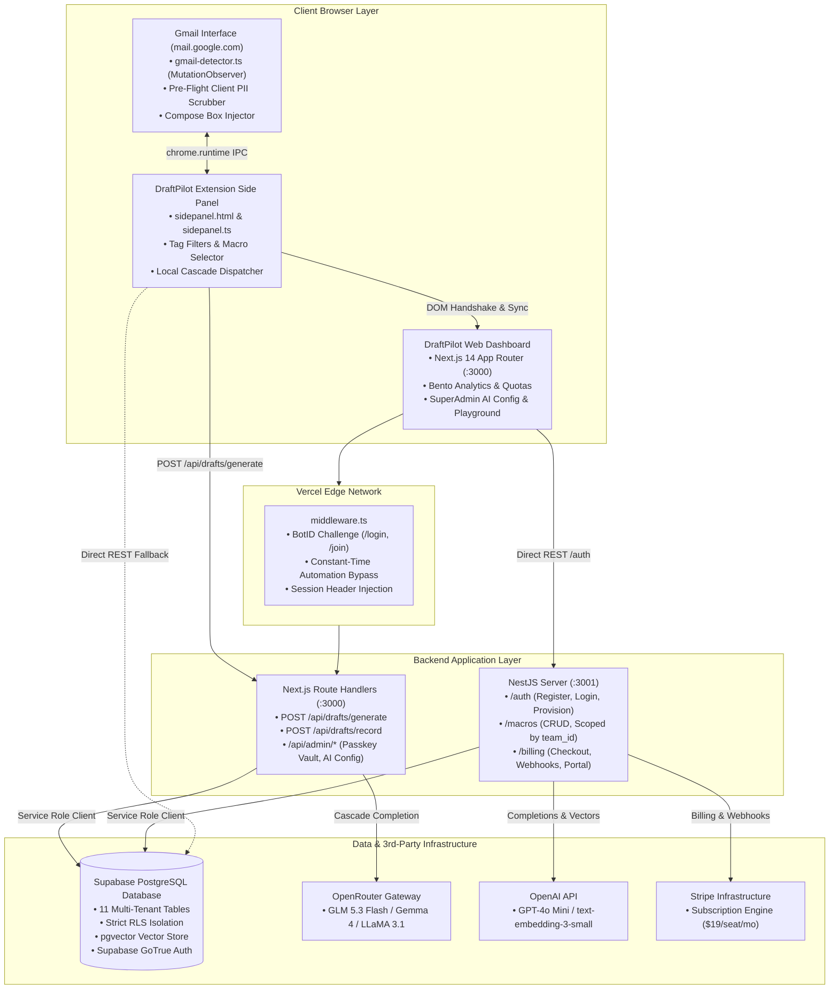

# DraftPilot: Technical Architecture, System Specification & Rebuild Playbook

> **Document Version:** 2.0.0 (Engineering Architecture & Rebuild Specification)  
> **System Name:** DraftPilot  
> **Repository:** `Sabbirshay/draftpilot`  
> **Monorepo Structure:** `packages/web` (Next.js 14), `packages/api` (NestJS 10), `packages/extension` (Chrome MV3)  
> **Target Audience:** Senior Software Engineers & Autonomous AI Coding Agents  

---

## 1. Product Overview

DraftPilot is an AI-powered customer support drafting co-pilot that operates directly within Gmail via a Chrome Manifest V3 extension, backed by a multi-tenant Next.js 14 web application and a NestJS 10 REST API. When a support agent opens an email thread in Gmail, the extension detects the conversation thread, executes client-side regex-based PII redaction (removing credit cards, phone numbers, emails, passwords, and security tokens before data leaves the machine), retrieves team-scoped macros and knowledge base documentation chunks, and dispatches the context to an AI inference cascade. The system generates tone-consistent, contextual draft replies that support agents can review, modify, and inject into the active Gmail compose box with a single click.

* **Target User:** Small customer support teams (1–10 agents), solo software founders, e-commerce store operators, and agency managers who handle repetitive support inquiries (order tracking, refunds, credentials, technical troubleshooting, invoices) directly within Gmail.
* **Core Value Proposition / Problem Solved:** Eliminates repetitive typing and cuts reply latency from minutes to seconds without forcing teams to abandon Gmail for complex, expensive help-desk platforms like Zendesk or Gorgias. It guarantees zero data-leakage via client-side pre-flight PII sanitization and prevents AI hallucinations via strict grounding in team macros and documentation.

---

## 2. Tech Stack

### Frontend Applications

#### 1. Web Application (`packages/web`)
* **Language:** TypeScript 5.9.3
* **Framework:** Next.js 14.2.35 (React 18.3.1, App Router architecture)
* **UI & Styling:** Tailwind CSS 3.4.19, PostCSS 8.5.26, Autoprefixer 10.5.4, custom CSS variables for obsidian dark theme (`#08090b`)
* **Motion & Physics:** Framer Motion 11.18.2, motion 13.1.1 (used for 3D staggered flip typography and interactive physics badges)
* **Document Parsing:** SheetJS / xlsx 0.20.3 (for client-side and server-side parsing of tabular Excel knowledge base files)
* **State Management:** React Context (`AuthProvider.tsx`), local component state (`useState`, `useEffect`), and native browser `localStorage` synchronization
* **Anti-Bot & Abuse Mitigation:** Vercel BotID (`botid` 1.5.11) with timing-safe automation bypass headers in `middleware.ts`

#### 2. Chrome Extension (`packages/extension`)
* **Specification:** Chrome Extensions Manifest V3 (MV3)
* **Language:** TypeScript 5.9.3
* **Bundler & Build Tool:** Vite 5.4.21 (configured for multi-entrypoint builds targeting content scripts, background worker, and sidepanel)
* **UI Architecture:** Zero-framework vanilla DOM and Web Components for maximum execution speed, zero memory bloat, and minimal bundle footprint (< 70 KB uncompressed)
* **Chrome APIs Leveraged:** `chrome.sidePanel`, `chrome.storage.local`, `chrome.runtime`, `chrome.tabs`, `chrome.scripting`

### Backend Service (`packages/api`)
* **Language:** TypeScript 5.9.3
* **Framework:** NestJS 10.4.22
* **HTTP Adapter:** Express (`@nestjs/platform-express` 10.4.22)
* **Runtime:** Node.js (tested and verified on Node `v22.7.0`, engine requirement `>=20.0.0`)
* **Validation & Serialization:** `class-validator` 0.14.4, `class-transformer` 0.5.1, NestJS global `ValidationPipe`
* **Rate Limiting:** `@nestjs/throttler` 6.5.0
* **Documentation Engine:** Swagger / OpenAPI 7.4.2 (`@nestjs/swagger`) accessible at `/api/docs`

### Database, Storage & Isolation
* **Database Type:** Relational PostgreSQL 15+
* **Hosting Provider:** Supabase Cloud (`https://amjliubpbysvtiqpbgnh.supabase.co`)
* **Client Driver:** `@supabase/supabase-js` 2.112.3 (used in API and Web packages)
* **Vector Similarity Engine:** PostgreSQL `pgvector` extension (`vector(1536)` embeddings with cosine similarity operator `<=>`)
* **Tenant Isolation:** Native PostgreSQL Row-Level Security (RLS) policies on all 11 tables strictly scoped to `team_id`

### Authentication & Authorization
* **Method:** Supabase Auth (GoTrue) utilizing JSON Web Tokens (JWT)
* **Strategies:** Email + password authentication and Google OAuth
* **Session Persistence:** 30-day JWT sessions stored in browser `localStorage` (`draftpilot_token`), synchronized to Chrome Extension storage via active window message handshake (`web-handshake.ts`)
* **Administrative Auth:** Dual-mode SuperAdmin authentication via constant-time byte comparison (`crypto.timingSafeEqual`) of `x-admin-passkey` against database singleton (`platform_settings.root_passkey`) or server-side env vars (`ADMIN_PASSKEY`), supplemented by SuperAdmin email whitelisting (`SUPERADMIN_EMAILS`)

### Third-Party Services Integrated
* **AI Model Inference (Primary):** OpenRouter API (`https://openrouter.ai/api/v1/chat/completions`) utilizing a 7-tier model cascade (`z-ai/glm-5.3-flash`, `z-ai/glm-5.2:free`, `google/gemma-4-31b-it:free`, `google/gemma-4-26b-a4b-it:free`, `meta-llama/llama-3.1-8b-instruct:free`, `meta-llama/llama-3.3-70b-instruct:free`, `mistralai/mistral-small-3.1-24b-instruct:free`)
* **AI Model Inference (Secondary/Fallback):** OpenAI API (`openai` 4.104.0) targeting `gpt-4o-mini` and `text-embedding-3-small`
* **Deterministic Fallback Engine:** Built-in offline domain intent synthesizer covering 7 customer support categories
* **Billing & Payments:** Stripe Node SDK 14.25.0 (API version `2023-10-16`) handling subscriptions ($19/seat/mo Team Plan), Checkout Sessions, Customer Billing Portal, and webhook events
* **Web Telemetry:** `@vercel/analytics` 2.0.1

### Hosting & Infrastructure
* **Frontend Web Application:** Vercel Edge & Serverless Platform (configured via root `vercel.json`)
* **Backend API Server:** Node.js standalone process / Docker container (compatible with Railway, Render, Fly.io, or Google Cloud Run; port `3001`)
* **Database & Auth:** Supabase managed cloud infrastructure
* **Extension Distribution:** Chrome Web Store (packaged zip in `packages/web/public/draftpilot-extension.zip`)
* **CI / Test Pipeline:** Local & GitHub Actions compatible via `pnpm test` (running Node 22 test runner and Jest 29)

### Package Manager & Key Dependencies

Root package manager: `pnpm@10.34.5` (`pnpm-lock.yaml`, workspace rules: `packages/*`).

| Workspace | Package | Version | Purpose |
|---|---|---|---|
| **Root** | `typescript` | `5.9.3` | Shared type system and compilation rules |
| **Root** | `pnpm` | `10.34.5` | Monorepo dependency resolution and workspace links |
| `packages/web` | `next` | `14.2.35` | SSR, dynamic API route handlers, React framework |
| `packages/web` | `react` / `react-dom` | `18.3.1` | UI rendering engine |
| `packages/web` | `tailwindcss` | `3.4.19` | Utility-first CSS styling engine |
| `packages/web` | `framer-motion` | `11.18.2` | Complex interactive animations and UI physics |
| `packages/web` | `@supabase/supabase-js` | `2.112.3` | Database access client and authentication client |
| `packages/web` | `botid` | `1.5.11` | Bot protection and request integrity |
| `packages/web` | `xlsx` | `0.20.3` | SheetJS Excel spreadsheet parsing engine |
| `packages/api` | `@nestjs/core` / `@nestjs/common` | `10.4.22` | Enterprise backend framework architecture |
| `packages/api` | `@nestjs/platform-express` | `10.4.22` | Express HTTP server engine |
| `packages/api` | `@nestjs/swagger` | `7.4.2` | OpenAPI specification generation |
| `packages/api` | `@nestjs/throttler` | `6.5.0` | IP and token rate limiting |
| `packages/api` | `stripe` | `14.25.0` | Stripe API integration and webhook verification |
| `packages/api` | `openai` | `4.104.0` | OpenAI official SDK client |
| `packages/api` | `class-validator` | `0.14.4` | DTO parameter validation decorators |
| `packages/extension` | `vite` | `5.4.21` | High-speed extension bundler |
| `packages/extension` | `@types/chrome` | `0.0.254` | Official Chrome Extension TypeScript definitions |

---

## 3. Architecture

### 3.1 High-Level System Architecture Diagram



### 3.2 Request Lifecycle: Live Gmail Draft Generation & Insertion

1. **DOM Detection & Event Trigger:**
   * Support agent opens a customer inquiry in Gmail (`mail.google.com`).
   * In `packages/extension/src/content/gmail-detector.ts`, a `MutationObserver` detects thread content within DOM selectors `span.gD` (sender), `h2.hP` (subject), and `.a3s.aiL` (body text).
2. **Pre-Flight Client-Side PII Scrubbing:**
   * `gmail-detector.ts` invokes local function `scrubPII()` (`packages/extension/src/utils/pii-scrubber.ts`).
   * Multi-pattern regular expressions redact credit cards, emails, SSNs, phone numbers, addresses, IP addresses, JWT tokens, and passwords into structured tokens (`[CARD_REDACTED]`, `[EMAIL_REDACTED]`). No raw customer data leaves the user's browser.
3. **IPC Dispatch to Sidepanel:**
   * `gmail-detector.ts` calls `chrome.runtime.sendMessage({ type: 'THREAD_DETECTED', text: scrubbedText, hasCompose: true })`.
   * `packages/extension/src/sidepanel/sidepanel.ts` receives the event and renders thread status and matching macro chips.
4. **API Request Dispatch:**
   * Agent clicks **Generate Draft** or selects a macro chip.
   * Extension `ApiClient` (`packages/extension/src/utils/api-client.ts`) sends `POST /api/drafts/generate` to the Next.js server with payload:
     `{ threadContent, matchedMacro, kbSnippets, macroHint, customInstruction }` and header `Authorization: Bearer <supabase_jwt>`.
5. **Server Authentication & Quota Verification:**
   * Route handler in `packages/web/src/app/api/drafts/generate/route.ts` validates the JWT via `supabaseAdmin.auth.getUser(token)`.
   * Route checks `banned_emails` table to verify user is active.
   * Route queries `teams` and `usage` tables: verifies that current monthly draft count has not exceeded `monthly_draft_limit` (default 50 for free, 1,000/seat for team).
6. **RAG Knowledge Base Grounding & Prompt Compilation:**
   * Route queries `macros` and `document_chunks` for snippets matching thread keywords.
   * Prompt compiler combines:
     * Base system prompt (`platform_settings.system_prompt`).
     * Mandatory structural rules (greeting `"Hi {customerName},"`, closing sign-off).
     * Supervisor instructions (`macroHint` / `customInstruction`), which take overriding precedence.
     * Retrieved macro and documentation context.
7. **Multi-Model Inference Cascade:**
   * Route initiates fetch to OpenRouter (`https://openrouter.ai/api/v1/chat/completions`) with a 12-second timeout on primary candidate `z-ai/glm-5.3-flash`.
   * If rate-limited (HTTP 429), server error (HTTP 5xx), or timeout occurs, it falls back sequentially through `z-ai/glm-5.2:free`, `google/gemma-4-31b-it:free`, `google/gemma-4-26b-a4b-it:free`, `meta-llama/llama-3.1-8b-instruct:free`, `meta-llama/llama-3.3-70b-instruct:free`, and `mistralai/mistral-small-3.1-24b-instruct:free`.
   * If all models fail, it activates `synthesizeSmartSupportDraft()` for offline deterministic domain generation.
8. **Output Sanitization (`cleanAiDraft`):**
   * Server strips XML `<think>` reasoning tags, markdown formatting bold headers (`**Thinking Process:**`), and meta preambles (`"Here is your draft:"`).
   * Normalizes customer greeting and sign-off placeholders (`[Your Name]` → `'Customer Support Team'`).
9. **Return & Client Injection:**
   * API responds with `{ draft, source: 'openrouter', modelUsed, customerName }`.
   * Extension sidepanel displays draft text and renders authentic badge `✨ AI Generated`.
   * Agent clicks **Insert Draft**. `gmail-detector.ts` locates `div[role="textbox"][g_editable="true"]`, applies the DOM Range/Selection API, inserts formatted HTML with linebreaks, and dispatches native browser `input`, `change`, and `keyup` events so Gmail commits the draft.

### 3.3 Folder & Module Map

```
/
├── .agents/                    # Agent prompt specifications and tool definitions
├── .tools/                     # Local self-contained Node.js v22 and pnpm binaries
├── packages/                   # Monorepo workspaces directory
│   ├── api/                    # NestJS backend REST API service (port 3001)
│   │   ├── src/                # NestJS application source code
│   │   │   ├── auth/           # Authentication guards, JWT validation, provisioning
│   │   │   ├── billing/        # Stripe checkout, portal, and webhook handlers
│   │   │   ├── config/         # Supabase connection service and env providers
│   │   │   ├── drafts/         # Draft generation service and model providers
│   │   │   ├── macros/         # Team-scoped macro CRUD operations
│   │   │   ├── utils/          # Backend PII scrubbing engine and regex definitions
│   │   │   ├── app.module.ts   # Dependency injection root module
│   │   │   └── main.ts         # Server bootstrap, CORS setup, Swagger OpenAPI
│   │   └── supabase/           # PostgreSQL migration files (001 through 008)
│   │       └── migrations/     # Tables, indexes, RLS policies, pgvector RPCs
│   │
│   ├── extension/              # Chrome Extension Manifest V3 application
│   │   ├── icons/              # Extension icons (16px, 48px, 128px)
│   │   ├── scripts/            # Packaging automation (build-zip.js)
│   │   └── src/                # Extension TypeScript source code
│   │       ├── background/     # Background service worker (action click handlers)
│   │       ├── content/        # Gmail DOM detector and Web dashboard handshake
│   │       ├── sidepanel/      # SidePanel user interface, styles, and controllers
│   │       └── utils/          # API client, PII scrubber, customer name extractor
│   │
│   └── web/                    # Next.js 14 App Router web application (port 3000)
│       ├── public/             # Static assets, compiled extension zips, PDFs
│       └── src/                # Next.js web application source code
│           ├── app/            # App Router pages and Edge/Node API route handlers
│           │   ├── admin/      # SuperAdmin command center pages and login
│           │   ├── api/        # REST API endpoints (drafts, metrics, admin, support)
│           │   ├── auth/       # OAuth callback page handler
│           │   ├── dashboard/  # Customer analytics, macros, seats, settings pages
│           │   ├── join/       # User registration page
│           │   └── login/      # User authentication page
│           ├── components/     # React component library (admin, dashboard, landing)
│           ├── lib/            # Shared utilities (Admin Auth, PII Scrubber, Supabase)
│           └── middleware.ts   # BotID challenge & constant-time automation bypass
│
├── .env.example                # Canonical environment variable documentation
├── package.json                # Root monorepo script coordinator
├── pnpm-lock.yaml              # Deterministic package dependency lockfile
├── pnpm-workspace.yaml         # PNPM workspace definition
├── tsconfig.base.json          # Shared compiler configuration for TypeScript
└── vercel.json                 # Vercel deployment configuration for web package
```

---

## 4. Data Model

The data layer is implemented in PostgreSQL and hosted on Supabase. Multi-tenancy is enforced using foreign keys pointing to `teams(id)` coupled with PostgreSQL Row-Level Security (RLS).

### 4.1 Relational Schema & Table Definitions

Source: `packages/api/supabase/migrations/001_initial_schema.sql` through `008_platform_settings_root_passkey.sql`.

```
               ┌──────────────────────────────┐
               │            teams             │
               ├──────────────────────────────┤
               │ id (UUID, PK)                │◄────────┐
               │ name (TEXT)                  │         │
               │ plan (TEXT)                  │         │
               │ stripe_customer_id (TEXT)    │         │
               │ stripe_subscription_id (TEXT)│         │
               │ monthly_draft_limit (INT)    │         │
               │ created_at (TIMESTAMPTZ)     │         │
               └──────────────┬───────────────┘         │
                              │ 1:N                     │
                              ▼                         │
               ┌──────────────────────────────┐         │
               │            users             │         │
               ├──────────────────────────────┤         │
               │ id (UUID, PK, auth.uid)      │         │
               │ team_id (UUID, FK) ──────────┼─────────┤
               │ email (TEXT)                 │         │
               │ role (TEXT)                  │         │
               │ full_name (TEXT)             │         │
               │ avatar_url (TEXT)            │         │
               │ created_at (TIMESTAMPTZ)     │         │
               └──────────────┬───────────────┘         │
                              │                         │
         ┌────────────────────┼────────────────────┐    │
         │ 1:N                │ 1:N                │    │
         ▼                    ▼                    ▼    │
┌─────────────────┐  ┌──────────────────┐  ┌──────────────────────┐
│  team_members   │  │  draft_history   │  │   onboarding_state   │
├─────────────────┤  ├──────────────────┤  ├──────────────────────┤
│ id (UUID, PK)   │  │ id (UUID, PK)    │  │ id (UUID, PK)        │
│ team_id (FK)────┼──┼─► team_id (FK)   │  │ team_id (FK, UNIQUE)─┼──┐
│ user_id (FK)    │  │ user_id (FK)     │  │ gmail_connected(BOOL)│  │
│ role (TEXT)     │  │ thread_snippet   │  │ first_macro(BOOL)    │  │
│ created_at      │  │ generated_draft  │  │ ext_installed(BOOL)  │  │
└─────────────────┘  │ macro_used_id(FK)│  │ viewed_demo(BOOL)    │  │
                     │ was_sent (BOOL)  │  │ updated_at           │  │
                     │ created_at       │  └──────────────────────┘  │
                     └──────────────────┘                            │
                                                                     │
         ┌───────────────────────────────────────────────────────────┘
         │ 1:N
         ├───────────────────────────┬───────────────────────────┐
         ▼                           ▼                           ▼
┌──────────────────┐        ┌──────────────────┐        ┌──────────────────┐
│      macros      │        │ knowledge_docs   │        │      usage       │
├──────────────────┤        ├──────────────────┤        ├──────────────────┤
│ id (UUID, PK)    │        │ id (UUID, PK)    │        │ id (UUID, PK)    │
│ team_id (FK)     │        │ team_id (FK)     │        │ team_id (FK)     │
│ name (TEXT)      │        │ name (TEXT)      │        │ month (DATE)     │
│ category (TEXT)  │        │ file_type (TEXT) │        │ draft_count (INT)│
│ content (TEXT)   │        │ file_size (TEXT) │        │ UNIQUE(team, mo) │
│ tags (TEXT[])    │        │ chunks_count(INT)│        └──────────────────┘
│ usage_count(INT) │        │ status (TEXT)    │
│ created_at       │        │ created_at       │
│ updated_at       │        └────────┬─────────┘
└──────────────────┘                 │ 1:N
                                     ▼
                            ┌──────────────────┐
                            │ document_chunks  │
                            ├──────────────────┤
                            │ id (UUID, PK)    │
                            │ document_id (FK) │
                            │ team_id (FK)     │
                            │ chunk_text (TEXT)│
                            │ chunk_index(INT) │
                            │ embedding(vector)│
                            │ created_at       │
                            └──────────────────┘

   [Singleton Table]                  [Platform Registry Table]
┌─────────────────────────┐          ┌─────────────────────────┐
│    platform_settings    │          │      banned_emails      │
├─────────────────────────┤          ├─────────────────────────┤
│ id (UUID, PK)           │          │ id (UUID, PK)           │
│ ai_provider (TEXT)      │          │ email (TEXT, UNIQUE)    │
│ openrouter_api_key      │          │ reason (TEXT)           │
│ openrouter_model        │          │ banned_by (TEXT)        │
│ openai_api_key          │          │ created_at              │
│ anthropic_api_key       │          │ updated_at              │
│ selected_model          │          └─────────────────────────┘
│ system_prompt           │
│ temperature (NUMERIC)   │
│ max_tokens (INT)        │
│ root_passkey (TEXT)     │
│ updated_at              │
└─────────────────────────┘
```

#### Detailed Column Definitions & Indexes

1. **`teams`**
   * `id`: `UUID PRIMARY KEY DEFAULT gen_random_uuid()`
   * `name`: `TEXT NOT NULL`
   * `plan`: `TEXT NOT NULL DEFAULT 'free' CHECK (plan IN ('free', 'team', 'enterprise'))`
   * `stripe_customer_id`: `TEXT NULL`
   * `stripe_subscription_id`: `TEXT NULL`
   * `monthly_draft_limit`: `INTEGER NOT NULL DEFAULT 50`
   * `created_at`: `TIMESTAMPTZ NOT NULL DEFAULT NOW()`

2. **`users`**
   * `id`: `UUID PRIMARY KEY` (Maps to Supabase Auth ID `auth.users.id`)
   * `team_id`: `UUID NOT NULL REFERENCES teams(id) ON DELETE CASCADE`
   * `email`: `TEXT NOT NULL`
   * `role`: `TEXT NOT NULL DEFAULT 'owner' CHECK (role IN ('owner', 'admin', 'member'))`
   * `full_name`: `TEXT NULL` (Added in migration 002)
   * `avatar_url`: `TEXT NULL` (Added in migration 002)
   * `created_at`: `TIMESTAMPTZ NOT NULL DEFAULT NOW()`
   * *Index:* `CREATE INDEX idx_users_team ON users(team_id);`

3. **`team_members`**
   * `id`: `UUID PRIMARY KEY DEFAULT gen_random_uuid()`
   * `team_id`: `UUID NOT NULL REFERENCES teams(id) ON DELETE CASCADE`
   * `user_id`: `UUID NOT NULL REFERENCES users(id) ON DELETE CASCADE`
   * `role`: `TEXT NOT NULL DEFAULT 'member' CHECK (role IN ('owner', 'admin', 'member'))`
   * `created_at`: `TIMESTAMPTZ NOT NULL DEFAULT NOW()`
   * *Constraints:* `UNIQUE(team_id, user_id)`
   * *Indexes:* `idx_team_members_team ON team_members(team_id)`, `idx_team_members_user ON team_members(user_id)`

4. **`onboarding_state`**
   * `id`: `UUID PRIMARY KEY DEFAULT gen_random_uuid()`
   * `team_id`: `UUID NOT NULL REFERENCES teams(id) ON DELETE CASCADE UNIQUE`
   * `gmail_connected`: `BOOLEAN NOT NULL DEFAULT false`
   * `first_macro_added`: `BOOLEAN NOT NULL DEFAULT false`
   * `extension_installed`: `BOOLEAN NOT NULL DEFAULT false`
   * `viewed_demo`: `BOOLEAN NOT NULL DEFAULT false`
   * `updated_at`: `TIMESTAMPTZ NOT NULL DEFAULT NOW()`
   * *Index:* `idx_onboarding_state_team ON onboarding_state(team_id)`

5. **`macros`**
   * `id`: `UUID PRIMARY KEY DEFAULT gen_random_uuid()`
   * `team_id`: `UUID NOT NULL REFERENCES teams(id) ON DELETE CASCADE`
   * `name`: `TEXT NOT NULL`
   * `category`: `TEXT DEFAULT 'General'`
   * `content`: `TEXT NOT NULL`
   * `tags`: `TEXT[] DEFAULT '{}'`
   * `usage_count`: `INTEGER NOT NULL DEFAULT 0`
   * `created_at`: `TIMESTAMPTZ NOT NULL DEFAULT NOW()`
   * `updated_at`: `TIMESTAMPTZ NOT NULL DEFAULT NOW()`
   * *Index:* `idx_macros_team ON macros(team_id)`

6. **`knowledge_documents`**
   * `id`: `UUID PRIMARY KEY DEFAULT gen_random_uuid()`
   * `team_id`: `UUID NOT NULL REFERENCES teams(id) ON DELETE CASCADE`
   * `name`: `TEXT NOT NULL`
   * `file_type`: `TEXT NOT NULL`
   * `file_size`: `TEXT NOT NULL`
   * `chunks_count`: `INTEGER NOT NULL DEFAULT 0`
   * `status`: `TEXT NOT NULL DEFAULT 'ready' CHECK (status IN ('processing', 'ready', 'error'))`
   * `created_at`: `TIMESTAMPTZ NOT NULL DEFAULT NOW()`
   * *Index:* `idx_knowledge_docs_team ON knowledge_documents(team_id)`

7. **`document_chunks`**
   * `id`: `UUID PRIMARY KEY DEFAULT gen_random_uuid()`
   * `document_id`: `UUID NOT NULL REFERENCES knowledge_documents(id) ON DELETE CASCADE`
   * `team_id`: `UUID NOT NULL REFERENCES teams(id) ON DELETE CASCADE`
   * `chunk_text`: `TEXT NOT NULL`
   * `chunk_index`: `INTEGER NOT NULL DEFAULT 0`
   * `embedding`: `vector(1536)` (OpenAI small vector length)
   * `created_at`: `TIMESTAMPTZ NOT NULL DEFAULT NOW()`
   * *Index:* `idx_doc_chunks_team ON document_chunks(team_id)`

8. **`usage`**
   * `id`: `UUID PRIMARY KEY DEFAULT gen_random_uuid()`
   * `team_id`: `UUID NOT NULL REFERENCES teams(id) ON DELETE CASCADE`
   * `month`: `DATE NOT NULL` (Formatted as `YYYY-MM-01`)
   * `draft_count`: `INTEGER NOT NULL DEFAULT 0`
   * *Constraints:* `UNIQUE(team_id, month)`
   * *Index:* `idx_usage_team_month ON usage(team_id, month)`

9. **`draft_history`**
   * `id`: `UUID PRIMARY KEY DEFAULT gen_random_uuid()`
   * `team_id`: `UUID NOT NULL REFERENCES teams(id) ON DELETE CASCADE`
   * `user_id`: `UUID NOT NULL REFERENCES users(id) ON DELETE CASCADE`
   * `thread_snippet`: `TEXT NULL`
   * `generated_draft`: `TEXT NOT NULL`
   * `macro_used_id`: `UUID REFERENCES macros(id) ON DELETE SET NULL`
   * `was_sent`: `BOOLEAN DEFAULT false`
   * `created_at`: `TIMESTAMPTZ NOT NULL DEFAULT NOW()`
   * *Index:* `idx_draft_history_team ON draft_history(team_id)`

10. **`platform_settings`** (Singleton row managed by SuperAdmin)
    * `id`: `UUID PRIMARY KEY DEFAULT gen_random_uuid()`
    * `ai_provider`: `TEXT NOT NULL DEFAULT 'openrouter' CHECK (ai_provider IN ('openrouter', 'openai', 'anthropic', 'offline'))`
    * `openrouter_api_key`: `TEXT NULL`
    * `openrouter_model`: `TEXT DEFAULT 'meta-llama/llama-3.1-8b-instruct:free'`
    * `openai_api_key`: `TEXT NULL`
    * `anthropic_api_key`: `TEXT NULL`
    * `selected_model`: `TEXT DEFAULT 'meta-llama/llama-3.1-8b-instruct:free'`
    * `system_prompt`: `TEXT NULL`
    * `temperature`: `NUMERIC(3,2) DEFAULT 0.4`
    * `max_tokens`: `INTEGER DEFAULT 300`
    * `root_passkey`: `TEXT NULL` (Added in migration 008)
    * `updated_at`: `TIMESTAMPTZ NOT NULL DEFAULT NOW()`

11. **`banned_emails`** (Global Deactivated Registry)
    * `id`: `UUID PRIMARY KEY DEFAULT gen_random_uuid()`
    * `email`: `TEXT NOT NULL UNIQUE`
    * `reason`: `TEXT DEFAULT 'Banned by Super Admin'`
    * `banned_by`: `TEXT NULL`
    * `created_at`: `TIMESTAMPTZ NOT NULL DEFAULT NOW()`
    * `updated_at`: `TIMESTAMPTZ NOT NULL DEFAULT NOW()`
    * *Index:* `CREATE UNIQUE INDEX idx_banned_emails_lower_email ON banned_emails (LOWER(email));`

### 4.2 Vector Search RPC Function (`match_document_chunks`)

```sql
CREATE OR REPLACE FUNCTION match_document_chunks (
  query_embedding vector(1536),
  match_threshold float,
  match_count int,
  p_team_id uuid
)
RETURNS TABLE (
  id uuid,
  document_id uuid,
  chunk_text text,
  similarity float
)
LANGUAGE plpgsql
AS $$
BEGIN
  RETURN QUERY
  SELECT
    document_chunks.id,
    document_chunks.document_id,
    document_chunks.chunk_text,
    1 - (document_chunks.embedding <=> query_embedding) AS similarity
  FROM document_chunks
  WHERE document_chunks.team_id = p_team_id
    AND 1 - (document_chunks.embedding <=> query_embedding) > match_threshold
  ORDER BY document_chunks.embedding <=> query_embedding
  LIMIT match_count;
END;
$$;
```

### 4.3 Row-Level Security (RLS) Policy Specifications

* **Service Role Access:** All tables grant unrestricted access to `service_role` via:
  `CREATE POLICY "Service Role Full Access" ON <table> TO service_role USING (true) WITH CHECK (true);`
* **Direct Authenticated User Access:**
  * `users`: `SELECT` allowed where `id = auth.uid()`. `UPDATE` allowed where `id = auth.uid()` and prevents changing `team_id` or `role`.
  * `teams`: `SELECT` allowed where `id IN (SELECT team_id FROM users WHERE id = auth.uid())`. `INSERT` restricted to `plan = 'free'` and `monthly_draft_limit = 50`.
  * `macros`, `knowledge_documents`, `document_chunks`, `draft_history`, `onboarding_state`: Scoped strictly by `team_id IN (SELECT team_id FROM users WHERE id = auth.uid())`.
  * `platform_settings`: Direct client read access is revoked (`DROP POLICY "Authenticated can read platform settings"`); access is exclusive to `service_role`.
  * `banned_emails`: Accessible strictly by `service_role`.

---

## 5. Features Implemented (Verified in Code Only)

### Feature 1: Pre-Flight Client-Side PII Scrubber
* **What it does:** Scans customer email threads in Gmail and redacts credit card numbers (13-19 digits), email addresses, US Social Security Numbers, phone numbers (7-15 digits), physical street addresses, IPv4 addresses, API keys (Bearer, sk-, ghp-, AKIA), JWT tokens, and passwords into structured placeholder tokens before text leaves the user's browser.
* **Key Files:** `packages/extension/src/utils/pii-scrubber.ts`, `packages/extension/src/content/gmail-detector.ts`, `packages/web/src/lib/pii-scrubber.ts`
* **External Dependencies:** None (pure regular expressions).

### Feature 2: Gmail DOM Thread Detection & 1-Click Draft Injection
* **What it does:** Monitors Gmail's DOM via `MutationObserver` to detect open threads (`h2.hP`, `span.gD`, `.a3s.aiL`) and open reply textboxes (`div[role="textbox"][contenteditable="true"]`). Injects sanitized drafts into the compose box using Selection and Range APIs with `execCommand` fallback, dispatching browser `InputEvent` and `KeyboardEvent` to ensure Gmail registers the draft.
* **Key Files:** `packages/extension/src/content/gmail-detector.ts`
* **External Dependencies:** Native Chrome Extension Content Script APIs.

### Feature 3: Web-to-Extension Auth Handshake Bridge
* **What it does:** Facilitates zero-configuration pairing between the web dashboard and the Chrome extension. Sets attributes on `document.documentElement` (`data-draftpilot-extension-installed="true"`), responds to window `DRAFTPILOT_EXTENSION_PING` messages, and bridges authentication tokens from `localStorage` into `chrome.storage.local`.
* **Key Files:** `packages/extension/src/content/web-handshake.ts`, `packages/web/src/components/dashboard/GmailSyncManager.tsx`
* **External Dependencies:** Native Chrome Runtime messaging (`chrome.runtime.sendMessage`).

### Feature 4: 7-Tier OpenRouter Model Cascade & Fallback Synthesizer
* **What it does:** Primary completion pipeline in Next.js route handler. Dispatches prompt to OpenRouter with candidate model sequence: `z-ai/glm-5.3-flash` → `z-ai/glm-5.2:free` → `google/gemma-4-31b-it:free` → `google/gemma-4-26b-a4b-it:free` → `meta-llama/llama-3.1-8b-instruct:free` → `meta-llama/llama-3.3-70b-instruct:free` → `mistralai/mistral-small-3.1-24b-instruct:free`. On total network or provider failure, falls back to `synthesizeSmartSupportDraft()` which deterministically crafts customer replies across 7 support categories.
* **Key Files:** `packages/web/src/app/api/drafts/generate/route.ts`, `packages/extension/src/utils/api-client.ts`, `packages/api/src/drafts/ai-provider.service.ts`
* **External Dependencies:** OpenRouter API, OpenAI API (secondary).

### Feature 5: Output Sanitization & Anti-Leak Engine (`cleanAiDraft`)
* **What it does:** Post-processes LLM generation text: strips XML `<think>...</think>` tags and truncated `<think>` blocks, removes markdown bold reasoning headers (`**Thinking Process:**`, `**Analyze User Input**`), strips code blocks, eliminates meta preambles (`"Here is a draft:"`), replaces template variables (`{{customer_name}}`), scrubs agent signature placeholders (`[Your Name]` → `'Customer Support Team'`), and personalizes greetings.
* **Key Files:** `packages/web/src/app/api/drafts/generate/route.ts`, `packages/extension/src/utils/api-client.ts`
* **External Dependencies:** None.

### Feature 6: Stripe Subscription & Seat Management Engine
* **What it does:** Provides self-serve billing for $19/seat/month Team plan and custom Enterprise tiers. Creates Stripe Checkout Sessions, generates Stripe Customer Portal sessions, and processes webhooks (`checkout.session.completed`, `customer.subscription.updated`, `customer.subscription.deleted`) to automatically update workspace quotas in `teams` and `usage`.
* **Key Files:** `packages/api/src/billing/billing.service.ts`, `packages/api/src/billing/billing.controller.ts`, `packages/web/src/components/dashboard/BillingManager.tsx`
* **External Dependencies:** Stripe API, `stripe` Node SDK.

### Feature 7: Vercel BotID Protection & Automation Bypass Middleware
* **What it does:** Edge middleware filtering automated bots from `/login` and `/join` routes via `checkBotId()`. Implements constant-time cryptographic verification (`timingSafeEqual`) for pre-shared bypass tokens across headers (`x-vercel-protection-bypass`, `x-agent-bypass-token`), cookies, and query parameters to allow automated testing and audit bots without friction.
* **Key Files:** `packages/web/src/middleware.ts`
* **External Dependencies:** `botid/server` package.

### Feature 8: SuperAdmin Command Center & AI Tuning Playground
* **What it does:** Private administrative portal (`/admin`) for platform operators. Features real-time platform metrics (workspaces, active seats, generation count), workspace quota modification, dynamic AI model tuning (switching models, setting temperature 0.0–1.0, max tokens 100–800, global system prompt), interactive test playground, global macro broadcasting, banned email management, and dynamic root passkey rotation without server restart.
* **Key Files:** `packages/web/src/app/admin/page.tsx`, `packages/web/src/components/admin/AdminAIConfig.tsx`, `packages/web/src/components/admin/AdminPasskeyVault.tsx`, `packages/web/src/lib/admin-auth.ts`, `packages/web/src/app/api/admin/*`
* **External Dependencies:** Supabase database.

---

## 6. API / Routes

### NestJS Backend API Routes (`packages/api`)

| Method | Path | Purpose | Auth Required | Request Body / Query Shape | Response Shape |
|---|---|---|---|---|---|
| `POST` | `/auth/register` | Register new user & workspace | None | `{ email: string, password: string, teamName?: string }` | `{ user: object, team: object, token: string }` |
| `POST` | `/auth/login` | Authenticate user | None | `{ email: string, password: string }` | `{ user: object, team: object, token: string }` |
| `POST` | `/auth/provision` | Provision user after OAuth | Bearer JWT | None (token in `Authorization` header) | `{ user: object, team: object, onboardingState: object, isFirstLogin: boolean }` |
| `GET` | `/auth/me` | Fetch authenticated user profile | Bearer JWT | None | `{ user: object, team: object }` |
| `GET` | `/auth/onboarding` | Fetch team onboarding checklist | Bearer JWT | None | `{ id, team_id, gmail_connected, first_macro_added, ... }` |
| `PATCH`| `/auth/onboarding` | Update onboarding milestones | Bearer JWT | `Partial<{ gmail_connected, first_macro_added, ... }>` | Updated onboarding record |
| `GET` | `/macros` | List team support macros | Bearer JWT | None | `Macro[]` |
| `GET` | `/macros/:id` | Fetch specific macro | Bearer JWT | Param `id: string` | `Macro` |
| `POST` | `/macros` | Create new support macro | Bearer JWT | `{ name: string, content: string, category?: string, tags?: string[] }` | Created `Macro` object |
| `PUT` | `/macros/:id` | Update existing macro | Bearer JWT | Param `id`, Body: `Partial<CreateMacroDto>` | Updated `Macro` object |
| `DELETE`| `/macros/:id`| Delete support macro | Bearer JWT | Param `id: string` | `{ success: true }` |
| `POST` | `/drafts/generate` | Generate AI draft reply | Bearer JWT | `{ prompt: string, threadContext?: string, matchedMacroId?: string, customerName?: string }` | `{ draft: string, customerName: string, source: string }` |
| `GET` | `/billing/usage` | Get monthly quota & usage | Bearer JWT | None | `{ draftsUsed: number, draftsLimit: number, plan: string, currentMonth: string }` |
| `POST` | `/billing/checkout` | Initiate Stripe checkout session | Bearer JWT | `{ cadence?: 'monthly'\|'yearly', seats?: number, tier?: string }` | `{ url: string }` (Stripe Checkout URL) |
| `POST` | `/billing/portal` | Access Stripe billing portal | Bearer JWT | None | `{ url: string }` (Stripe Customer Portal URL) |
| `POST` | `/billing/webhook` | Handle Stripe lifecycle webhooks | Stripe Signature | Raw Stripe Event payload | `{ received: true }` |

### Next.js Web App API Route Handlers (`packages/web`)

| Method | Path | Purpose | Auth Required | Request Body / Query Shape | Response Shape |
|---|---|---|---|---|---|
| `POST` | `/api/drafts/generate` | Core AI Draft Generation Cascade | Bearer JWT or `x-admin-passkey` | `{ threadContent: string, matchedMacro?: object, kbSnippets?: string[], macroHint?: string, forceSource?: string }` | `{ draft: string, source: string, modelUsed: string, customerName: string, confidence: number }` |
| `POST` | `/api/drafts/record` | Record draft generation audit | Bearer JWT or passkey | `{ threadSnippet: string, generatedDraft: string, macroUsedId?: string, teamId?: string }` | `{ success: true, id: string, draft_count: number }` |
| `GET` | `/api/auth/me` | Hydrate user & onboarding info | Bearer JWT | None | `{ user: object, team: object, onboardingState: object }` |
| `GET` | `/api/dashboard/metrics` | Retrieve workspace dashboard telemetry | Bearer JWT | Query: `?startDate=...&endDate=...` | `{ draftsCount: number, historyCount: number, monthlyLimit: number, macrosCount: number, teamPlan: string }` |
| `GET` | `/api/extension/heartbeat` | Healthcheck & version verify | None | None | `{ status: 'ok', version: '0.1.0', timestamp: number }` |
| `POST` | `/api/support/ticket` | Submit customer support ticket | None / Optional | `{ email: string, subject: string, message: string, priority?: string }` | `{ success: true, ticketId: string }` |
| `GET` | `/api/admin/metrics` | Platform-wide SuperAdmin metrics | SuperAdmin | None | `{ totalTeams: number, totalUsers: number, totalDrafts: number, totalMacros: number, recentDrafts: array }` |
| `GET` | `/api/admin/workspaces` | List all customer workspaces | SuperAdmin | None | `Workspace[]` with plan, seats, draft count |
| `PATCH`| `/api/admin/workspaces` | Override workspace quotas/limits | SuperAdmin | `{ workspaceId: string, monthlyLimit?: number, bonusQuota?: number, frozen?: boolean }` | Updated workspace object |
| `GET` | `/api/admin/ai-config` | Fetch platform AI config & keys | SuperAdmin | None | `PlatformSettings` with masked API keys |
| `POST` | `/api/admin/ai-config` | Update platform AI config & keys | SuperAdmin | `Partial<PlatformSettings>` | Updated `PlatformSettings` object |
| `GET` | `/api/admin/global-macros` | List system-wide global macros | SuperAdmin | None | `GlobalMacro[]` |
| `POST` | `/api/admin/global-macros` | Broadcast global macro to teams | SuperAdmin | `{ name: string, content: string, category: string, broadcastToAll: boolean }` | `{ success: true, broadcastCount: number }` |
| `GET` | `/api/admin/users` | List all platform users | SuperAdmin | None | `UserWithTeam[]` |
| `POST` | `/api/admin/users` | Ban / deactivate user account | SuperAdmin | `{ action: 'ban'\|'unban', email: string, reason?: string }` | `{ success: true, banned: boolean }` |
| `GET` | `/api/admin/passkey` | Inspect root passkey status | SuperAdmin | None | `{ hasDynamicPasskey: boolean, passkeyPreview: string }` |
| `POST` | `/api/admin/passkey` | Rotate root passkey dynamically | SuperAdmin | `{ rootPasskey: string }` | `{ success: true }` |
| `GET` | `/api/admin/feature-flags` | Fetch global system feature flags | SuperAdmin | None | Feature flags state dictionary |
| `POST` | `/api/admin/feature-flags` | Toggle system feature flags | SuperAdmin | `{ flags: object }` | Updated feature flags dictionary |
| `GET` | `/api/admin/billing` | SuperAdmin gross margin analytics | SuperAdmin | None | Revenue breakdown and gross margin stats |

---

## 7. Environment & Configuration

### 7.1 Required Environment Variables (Names Only)

#### Web Service (`packages/web/.env`)
* `NEXT_PUBLIC_SUPABASE_URL`
* `NEXT_PUBLIC_SUPABASE_ANON_KEY`
* `SUPABASE_SERVICE_ROLE_KEY`
* `OPENROUTER_API_KEY`
* `NEXT_PUBLIC_OPENROUTER_API_KEY`
* `ADMIN_PASSKEY`
* `SUPERADMIN_PASSKEY`
* `SUPERADMIN_EMAILS`
* `NEXT_PUBLIC_API_URL`
* `VERCEL_AUTOMATION_BYPASS_SECRET`
* `AGENT_BYPASS_TOKEN`
* `AUTOMATION_BYPASS_SECRET`
* `BOTID_BYPASS_SECRET`
* `BOTID_VERIFICATION_KEY`

#### Backend API Service (`packages/api/.env`)
* `PORT` / `API_PORT`
* `FRONTEND_URL`
* `CORS_ORIGIN`
* `SUPABASE_URL`
* `SUPABASE_ANON_KEY`
* `SUPABASE_SERVICE_ROLE_KEY`
* `SUPABASE_JWT_SECRET`
* `STRIPE_SECRET_KEY`
* `STRIPE_PUBLISHABLE_KEY`
* `STRIPE_WEBHOOK_SECRET`
* `STRIPE_PRICE_ID` / `STRIPE_TEAM_PRICE_ID`
* `OPENAI_API_KEY`
* `AI_MODEL`
* `AI_MAX_OUTPUT_TOKENS`
* `FREE_TIER_MONTHLY_DRAFT_LIMIT`

### 7.2 Local Development Setup

```bash
# 1. Clone repository
git clone https://github.com/Sabbirshay/draftpilot.git
cd draftpilot

# 2. Add Node and pnpm to PATH
export PATH="$PWD/.tools/node/bin:$PATH"

# 3. Install dependencies across all monorepo workspaces
pnpm install

# 4. Configure local environment files
cp .env.example .env
# Populate values for Supabase, OpenRouter, and Stripe

# 5. Execute Supabase migrations 001 through 008 in sequence
# (via Supabase SQL Editor or Supabase CLI)

# 6. Start development servers
pnpm dev:web    # Next.js web application on http://localhost:3000
pnpm dev:api    # NestJS backend API on http://localhost:3001
pnpm dev:ext    # Chrome extension Vite bundler in watch mode

# 7. Execute test suite
pnpm test
```

### 7.3 Build & Deployment Process

* **Web Deployment (Vercel):**  
  Deploy using `vercel.json`:
  * Install command: `pnpm install --no-frozen-lockfile`
  * Build command: `pnpm --filter @draftpilot/web build`
  * Output directory: `packages/web/.next`
* **API Deployment (Container / VM):**  
  Build with `pnpm --filter @draftpilot/api build` and start with `node packages/api/dist/main.js`. Ensure environment variables are mapped and configure Stripe webhook destination to `/billing/webhook`.
* **Extension Packaging:**  
  Run `pnpm build:ext`. The script executes `vite build && cp manifest.json dist/ && cp -r icons dist/ && node scripts/build-zip.js` generating `packages/web/public/draftpilot-extension.zip` for upload to the Chrome Web Store.

---

## 8. Known Gaps / Incomplete / TODO

1. **Dual Draft Generation Pipelines:**
   * `packages/web/src/app/api/drafts/generate/route.ts` is the active, production-grade implementation with the 7-tier model cascade, hoisted RAG, and sanitization.
   * `packages/api/src/drafts/drafts.service.ts` contains an older, alternate draft generation path.  
   * *Status:* Functional redundancy. When rebuilding, consolidate to a single canonical API endpoint.
2. **Hardcoded Supabase Project URL & Anon Key Fallbacks:**
   * In `packages/web/src/lib/admin-auth.ts` (line 4) and `packages/extension/src/utils/api-client.ts` (line 3), the project URL `https://amjliubpbysvtiqpbgnh.supabase.co` is hardcoded as fallback when environment variables are omitted. Rebuilders must replace these with their own Supabase environment config.
3. **Hardcoded Fallback Service Role Key:**
   * In `packages/web/src/lib/admin-auth.ts` (line 8), a fallback token (`...resilient-admin-service-role-fallback`) is assigned if `SUPABASE_SERVICE_ROLE_KEY` is missing to avoid crashing at startup. It should be converted to an explicit assertion failure during build/boot.
4. **Default SuperAdmin Email Fallbacks:**
   * In `packages/web/src/lib/admin-auth.ts` (line 156), hardcoded fallback emails (`mdronykhan4633@gmail.com`, `admin@draftpilot.app`, etc.) are evaluated if `SUPERADMIN_EMAILS` is omitted.
5. **Dashboard Analytics Telemetry Simulators:**
   * In `packages/web/src/components/admin/AdminMetrics.tsx` and `AdminBillingAnalytics.tsx`, mock metrics ($48,250 MRR, $579,000 ARR) are displayed when the database contains no recorded draft history.

---

## 9. Rebuild Playbook

Follow these numbered steps to recreate DraftPilot from scratch:

### Step 1: Initialize Monorepo & Dependencies
1. Initialize a Git repository with `pnpm init`.
2. Create `pnpm-workspace.yaml`:
   ```yaml
   packages:
     - 'packages/*'
   ```
3. Scaffold three workspaces:
   * `packages/web`: Initialize Next.js 14 (`next`, `react`, `react-dom`, `tailwindcss`, `framer-motion`, `motion`, `xlsx`, `botid`, `@supabase/supabase-js`, `@vercel/analytics`).
   * `packages/api`: Initialize NestJS 10 (`@nestjs/core`, `@nestjs/common`, `@nestjs/platform-express`, `@nestjs/swagger`, `@nestjs/throttler`, `@nestjs/config`, `class-validator`, `class-transformer`, `stripe`, `openai`, `@supabase/supabase-js`).
   * `packages/extension`: Initialize Vite + TypeScript (`vite`, `typescript`, `@types/chrome`).
4. Configure shared `tsconfig.base.json` with strict mode enabled.

### Step 2: Database Setup & Migrations
1. Create a Supabase project and enable the `vector` extension.
2. Apply migration scripts 001 through 008 in order:
   * Create tables: `teams`, `users`, `team_members`, `onboarding_state`, `macros`, `knowledge_documents`, `document_chunks`, `usage`, `draft_history`, `platform_settings`, `banned_emails`.
   * Create function `match_document_chunks` using cosine distance `<=>`.
   * Enable RLS on all 11 tables with service role bypass and user `team_id` matching policies.
3. Seed a singleton row in `platform_settings` with your default AI provider and model.

### Step 3: Implement Core Packages (in Order)

#### A. Extension Core (`packages/extension`)
1. Create `manifest.json` (MV3, permissions: `sidePanel`, `storage`, `activeTab`, `tabs`, `scripting`; host permissions: `*://mail.google.com/*`, `https://openrouter.ai/*`, Supabase and Vercel domains).
2. Implement `src/utils/pii-scrubber.ts`: regular expression scrubbing for cards, emails, SSNs, phones, addresses, IP addresses, tokens, and passwords.
3. Implement `src/content/gmail-detector.ts`: `MutationObserver` on Gmail DOM, thread extraction from `h2.hP` and `.a3s.aiL`, Selection API draft insertion, and IPC message dispatch.
4. Implement `src/content/web-handshake.ts`: DOM attribute tagging and token bridging from web dashboard `localStorage` to `chrome.storage.local`.
5. Implement `src/sidepanel/`: SidePanel HTML and controller rendering detected thread, macro filters, draft generation trigger, and injection buttons.
6. Configure `vite.config.ts` with multi-input rollup packaging for `service-worker`, `gmail-detector`, `web-handshake`, and `sidepanel`.

#### B. Backend API Service (`packages/api`)
1. Implement `src/config/supabase.service.ts`: initializes Supabase client with `service_role` credentials.
2. Implement `src/auth/`: `AuthGuard` (validates JWT, verifies user is not in `banned_emails`), `auth.controller.ts` (`/register`, `/login`, `/provision`, `/me`, `/onboarding`).
3. Implement `src/macros/`: `macros.controller.ts` with full CRUD strictly scoped to `req.user.team_id`.
4. Implement `src/billing/`: `billing.service.ts` with Stripe Checkout creation, Stripe Billing Portal session creation, and raw webhook signature verification.

#### C. Web Dashboard & AI Route (`packages/web`)
1. Implement `src/middleware.ts`: edge BotID check on `/login` and `/join` with constant-time automation bypass token validation.
2. Implement `src/lib/admin-auth.ts`: `verifySuperAdmin()` with timing-safe passkey verification and Supabase user checks.
3. Implement `src/app/api/drafts/generate/route.ts`:
   * Authenticate caller via JWT or `x-admin-passkey`.
   * Verify monthly quota in `usage` and `teams`.
   * Retrieve relevant KB snippets and macros.
   * Compile prompt with supervisor instructions taking precedence.
   * Dispatch OpenRouter 7-tier candidate cascade with 12s timeout per candidate.
   * Fallback to domain synthesizer if all models fail.
   * Sanitize output via `cleanAiDraft()` stripping `<think>` tags and reasoning headers.
4. Implement `src/app/admin/`: SuperAdmin Command Center with metrics, workspace quota manager, AI tuning playground, banned email manager, and passkey vault.
5. Implement `src/app/dashboard/`: Customer analytics bento grid, macro manager, team seat manager, billing meter, and Gmail sync center.
6. Implement `src/app/page.tsx`: Landing page with 3D staggered flip typography and interactive demo canvas.

### Step 4: Configure Integrations
1. Configure Stripe: create subscription price ($19/mo/seat), register webhook URL pointing to `/billing/webhook` with events `checkout.session.completed`, `customer.subscription.updated`, `customer.subscription.deleted`.
2. Configure OpenRouter: obtain API key, configure allowed models in `platform_settings`.
3. Configure Google OAuth in Supabase Auth settings.

### Step 5: Verify & Deploy
1. Run automated tests: `pnpm test` (all 626 tests must pass).
2. Build all workspaces: `pnpm build:web`, `pnpm build:api`, `pnpm build:ext`.
3. Deploy `packages/web` to Vercel.
4. Deploy `packages/api` to a Node container service (Railway, Render, or GCP).
5. Submit `packages/web/public/draftpilot-extension.zip` to the Chrome Web Store.

---

## 10. Glossary

* **`Macro`:** A pre-written, team-shared support response template containing canned explanations, policies, or FAQs, categorised with `#tags`.
* **`DraftPilot SidePanel`:** The native Chrome Manifest V3 side panel UI housing detected email context, macro chips, and generation controls.
* **`Pre-Flight PII Scrubber`:** The client-side regex engine executing in the Gmail tab that redacts sensitive personal data before HTTP transmission.
* **`OpenRouter Cascade`:** The sequential 7-tier model fallback algorithm in `/api/drafts/generate` that attempts completions across multiple open-weight models upon timeouts or rate limits.
* **`Domain Synthesizer`:** The deterministic, offline rule-based reply generator that crafts context-aware customer replies across 7 categories without external AI calls.
* **`cleanAiDraft`:** The output sanitization function that removes `<think>` reasoning traces, markdown code fences, and meta-preambles from LLM outputs.
* **`Web-Extension Handshake`:** The bidirectional DOM attribute and window message protocol bridging authentication credentials between the web dashboard and the Chrome extension.
* **`SuperAdmin Root Passkey`:** A server-verified secret allowing platform operators full access to `/admin` settings and the AI playground, stored in `platform_settings.root_passkey`.
* **`BotID Bypass Token`:** A pre-shared secret header (`x-vercel-protection-bypass`, `x-agent-bypass-token`) verified via constant-time comparison to allow automated audit bots through edge bot protection.
* **`pgvector`:** The PostgreSQL extension enabling 1536-dimensional vector storage and cosine similarity search for document embeddings.
