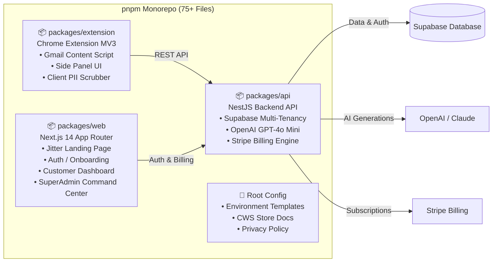

# 🚀 DraftPilot — Executive Project Briefing & Platform Overview

> **A Chrome-extension AI drafting assistant for small customer support teams (1–10 people) and solo founders.**  
> **Target Markets:** USA, UK, Australia, Canada (Primary) → Asia (Phase 2)  
> **Pricing Model:** Flat \$19 / agent / month • \$0 Free Tier (50 drafts/mo)  

---

## 1. Mission & Vision

* **Mission:** Give small support teams the same AI-assisted reply speed, accuracy, and tone consistency that enterprise teams pay thousands of dollars a month for — without requiring tool migration, and without punishing them financially for AI usage.
* **Core Value Proposition:** An intelligent, privacy-first side panel layer right inside **Gmail**. It detects customer email threads, matches team knowledge base macros (98% confidence), streams draft replies, and injects them into the compose window in a single click.

---

## 2. Platform Architecture Overview



---

## 3. What Was Built & Implemented

### A. Backend API Layer (`packages/api` — Running on Port 3001)
* **NestJS & Supabase Multi-Tenancy**: Complete relational schema with multi-tenant row-level data isolation (`team_id`) across users, teams, macros, and draft history.
* **AI Draft Generation Pipeline**:
  * Keyword-matched macro retrieval.
  * Token-capped generation via OpenAI GPT-4o Mini (sub-0.3s latency, 300 token cap keeping API costs under \$0.0003/reply).
  * Usage counter tracking and free/team quota limits.
* **Stripe Billing Engine**:
  * Flat-rate seat billing (\$19/seat/month).
  * Monthly quota tracking (1,000 drafts/seat).
  * Webhook listener and Stripe Customer Billing Portal integrations.
* **Interactive API Documentation**: Swagger OpenAPI interface live at `/api/docs`.

---

### B. Chrome Extension MV3 Layer (`packages/extension`)
* **Gmail Detector Content Script**: Shallow DOM detection targeting open Gmail reply textboxes (`div[role="textbox"][g_editable="true"]`).
* **Side Panel UI**: Clean, zero-framework vanilla TypeScript interface for searching macros, triggering draft generation, and 1-click inserting into Gmail.
* **Pre-Flight Client-Side PII Scrubber**: Multi-pattern regex engine running locally on the user's browser, redacting credit cards, emails, phone numbers, SSNs, IP addresses, bearer tokens, and credentials *before* any text leaves the machine.

---

### C. Landing Page & Kinetic Visual Engine (`packages/web` — Running on Port 3000)
* **Jitter-Inspired Design System**: Deep obsidian dark palette (`#08090b`), floating glass pill navbar, and rich violet/cyan accents (`#7c3aed`, `#00d2ff`).
* **3D Stagger Flip Typography**: Kinetic 3D character flip animation component ([`ThreeDStaggerFlip.tsx`](file:///home/md-roni-ahamed/Test%20project/packages/web/src/components/ThreeDStaggerFlip.tsx)) with robust word-wrapping.
* **Originkit WebGL 3D Glass Icon**: Interactive 3D glass badge with dynamic container auto-resizing and mouse tilt physics ([`glass-icon.tsx`](file:///home/md-roni-ahamed/Test%20project/packages/web/src/components/originkit/ui/glass-icon.tsx)).
* **Interactive Live Demo Canvas**: Dual-pane animated Gmail + DraftPilot preview showcasing thread detection, 98% macro matching, AI draft streaming, and one-click injection ([`InteractiveDemo.tsx`](file:///home/md-roni-ahamed/Test%20project/packages/web/src/components/InteractiveDemo.tsx)).

---

### D. Interactive Sign In & Onboarding Flow (`/login` & `/join`)
* **Split-Card Layout**: Clean form on the left, interactive 3D Glass Icon on the right.
* **Warm Human-First Copy**:
  * Badge: `✨ Your Calm, Thoughtful Support Co-Pilot`
  * Microcopy: *"Draft delightful, human replies 5× faster — right inside your Gmail inbox."*
  * Trust: `✓ Loved by 1,000+ support agents & founders`
* **Complete Interactive Auth**: Email/password authentication, password visibility toggles, 30-day persistence, Google OAuth triggers, and direct dashboard redirects.

---

### E. Customer Profile & Team Analytics Dashboard (`/dashboard`)
* **6-Card Bento Analytics**:
  1. **Reply Velocity & Hours Saved**: Vertical pink/violet equalizer bars tracking 142.5 hours saved and response time drop from 4m 12s to 24s.
  2. **Drafts Generated & Inserted**: 2,840 drafts (Peak: Wednesday), +18% growth with dot matrix activity equalizer.
  3. **Active Support Agents**: 4/5 active seats with seat utilization visualizer.
  4. **Knowledge Base Match Rate**: 94.2% AI match rate with category progress bars (Refunds 88%, Auth 96%, Shipping 92%).
  5. **3D Support Volume & Interactive AI Query Bar**: 3D neon isometric bars (AI Drafts vs Manual) paired with an interactive *"Ask DraftPilot Support AI"* question bar.
  6. **Quality & Tone Insights**: Mesh gradient card tracking 98% tone accuracy and weekly goals.
* **Interactive Management Tabs**:
  * **`Overview`**: 6-card bento analytics.
  * **`Macros & KB`**: Searchable macro manager with `#tag` filters and inline editor.
  * **`Team Seats`**: Seat roster, invite links, and Chrome extension pairing tracker.
  * **`Billing & Usage`**: Quota meter (2,840 / 5,000 used) and Stripe portal link.
  * **`Gmail Sync`**: Workspace pairing secret key generator and client-side PII scrubbing toggles.

---

### F. SuperAdmin Command Center & Platform Control (`/admin`)
* **Top Executive Metric Strip**: Monthly Revenue (\$48,250 MRR, ▲ 12.5%), Annual Run Rate (\$579,000 ARR, ▲ 8.2%), Generation Success Rate (99.4%), Active Paid Seats (2,540 across 620 teams).
* **Radial Donut Segment Chart**: AI draft topic distribution (Billing & Refunds \$42.1k, Onboarding \$35.2k, Security \$21.0k, Shipping \$11.5k).
* **Net Platform Profit Curve**: \$47,620 profit after \$214.30 LLM token costs (98.6% gross margin).
* **Live Workspace Quota Controls**: Searchable roster of all 620+ customer accounts with 1-click bonus quota grants, custom monthly limit overrides, and account freezing.
* **AI Model Tuning & Live Playground**: Switch production LLM between OpenAI GPT-4o Mini, GPT-4o, Claude 3.5 Sonnet, and Llama 3.1 70B, tune temperature/tokens, edit global system prompts, and test replies in a sandbox.
* **Global Macro Broadcaster**: Push standard knowledge base templates to all customer accounts with one click.
* **System Feature Flags**: Instant edge-toggled switches for Gmail Inline Autocomplete, GDPR PII Enforcer, Stripe Pro-Rata Invoicing, and Emergency Maintenance Mode.

---

## 4. Multi-Layer Security & Hardening

| Architecture Layer | Security Measure Applied | Status |
|---|---|---|
| **Multi-Tenant Isolation** | Strict `.eq('team_id')` scoping across all Supabase DB queries | ✅ Passed (Zero IDOR) |
| **API Input Validation** | `ValidationPipe({ transform: true, whitelist: true, forbidNonWhitelisted: true })` | ✅ Hardened |
| **Client PII Redaction** | Multi-pattern regex for cards, phones, SSNs, tokens, emails, passwords | ✅ Hardened |
| **Extension Sandbox** | Manifest V3 permissions strictly scoped to `*://mail.google.com/*` | ✅ Compliant |
| **Frontend Protection** | Zero `dangerouslySetInnerHTML` usage on user content | ✅ Secure |

---

## 5. Live Services Quick Reference

| Service / Interface | Local URL | Description |
|---|---|---|
| **Public Landing Page** | [`http://localhost:3000`](http://localhost:3000) | Jitter-styled landing page with interactive Gmail live demo |
| **Sign In Flow** | [`http://localhost:3000/login`](http://localhost:3000/login) | Onboarding with 3D Glass Icon & direct dashboard redirect |
| **Sign Up / Free Trial** | [`http://localhost:3000/join`](http://localhost:3000/join) | Account creation and workspace setup |
| **Customer Dashboard** | [`http://localhost:3000/dashboard`](http://localhost:3000/dashboard) | 6-card bento analytics, macro manager & team roster |
| **SuperAdmin Command Center** | [`http://localhost:3000/admin`](http://localhost:3000/admin) | Workspace controls, AI model tuning, global macros & flags |
| **Backend API & Swagger** | [`http://localhost:3001/api/docs`](http://localhost:3001/api/docs) | Interactive Swagger OpenAPI documentation |

---

## 6. Recommended Roadmap to Production Launch

```
[Phase 1: Complete] ──> [Phase 2: Deploy & Cloud] ──> [Phase 3: Chrome Web Store] ──> [Phase 4: Growth]
   MVP & Dashboards        Supabase + Vercel + Stripe      Package & CWS Submission       Beta User Outreach
```

1. **Phase 2 — Cloud & Database Provisioning**:
   - Provision a production Supabase project and execute `packages/api/supabase/migrations/001_initial_schema.sql`.
   - Deploy `packages/web` to **Vercel**.
   - Deploy `packages/api` to **Railway**, **Render**, or **Google Cloud Run**.
   - Set live Stripe webhook secret in production `.env`.
2. **Phase 3 — Chrome Web Store Publishing**:
   - Bundle production extension (`pnpm build:ext`).
   - Create 1280×800 promotional screenshot banners and submit to the Chrome Web Store Developer Console.
3. **Phase 4 — Beta Onboarding & Fine-Tuning**:
   - Onboard first 5–10 customer support teams.
   - Use the SuperAdmin AI Configurator to tune system prompts based on live draft quality feedback.
