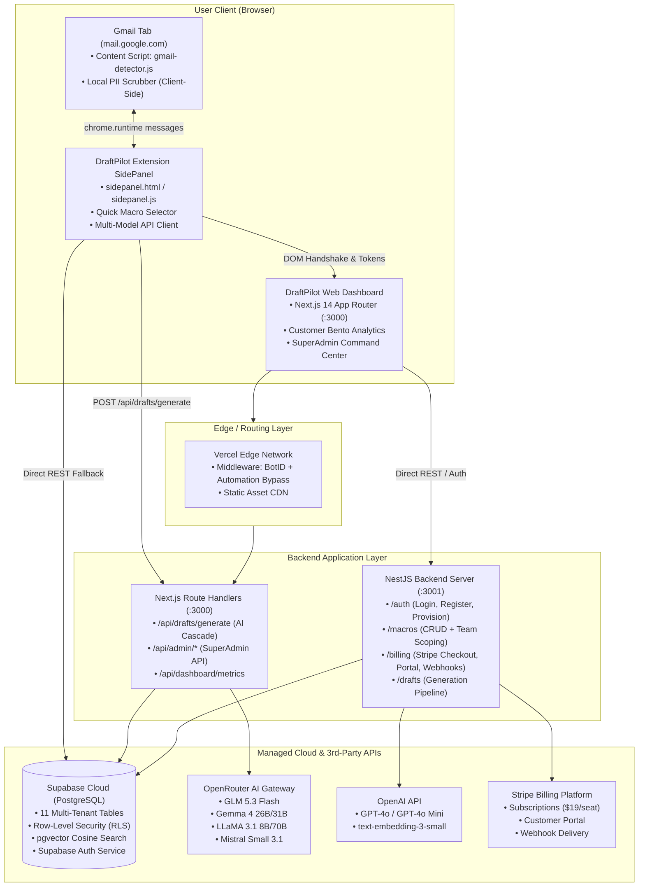

# Technical Due-Diligence Audit & System Specification: DraftPilot

> **Document Version:** 1.0.0  
> **Target Products:** DraftPilot Web Dashboard, NestJS API Server, Chrome Extension MV3  
> **Repository:** `Sabbirshay/draftpilot`  
> **Audit Date:** September 15, 2026  
> **Auditor Role:** Technical Due-Diligence Auditor & System Architect  

---

## Table of Contents

1. [Executive Summary (for Buyers)](#1-executive-summary-for-buyers)
2. [Feature Inventory](#2-feature-inventory)
   - [2.1 Authentication, Access Control & Tenant Security](#21-authentication-access-control--tenant-security)
   - [2.2 Customer & Team Dashboard](#22-customer--team-dashboard)
   - [2.3 Chrome Extension & Gmail Integration](#23-chrome-extension--gmail-integration)
   - [2.4 AI Draft Generation & Output Sanitization Engine](#24-ai-draft-generation--output-sanitization-engine)
   - [2.5 SuperAdmin Command Center & Platform Management](#25-superadmin-command-center--platform-management)
   - [2.6 Public Marketing, Onboarding & Growth](#26-public-marketing-onboarding--growth)
3. [Tech Stack](#3-tech-stack)
4. [Architecture](#4-architecture)
   - [4.1 High-Level System Diagram](#41-high-level-system-diagram)
   - [4.2 Core Data Flows](#42-core-data-flows)
   - [4.3 Monorepo & Directory Structure](#43-monorepo--directory-structure)
5. [Data Model](#5-data-model)
   - [5.1 Relational Schema & Table Definitions](#51-relational-schema--table-definitions)
   - [5.2 Vector Search & RPC Capabilities](#52-vector-search--rpc-capabilities)
   - [5.3 Row-Level Security (RLS) Policy Architecture](#53-row-level-security-rls-policy-architecture)
6. [Environment & Configuration](#6-environment--configuration)
   - [6.1 Required Environment Variables](#61-required-environment-variables)
   - [6.2 Required External Services & Accounts](#62-required-external-services--accounts)
7. [Setup & Run Instructions](#7-setup--run-instructions)
   - [7.1 Local Development Environment](#71-local-development-environment)
   - [7.2 Production Deployment Procedures](#72-production-deployment-procedures)
8. [Known Issues & Technical Debt](#8-known-issues--technical-debt)
9. [Security Notes](#9-security-notes)
10. [Machine-Readable Summary (for AI Agents)](#10-machine-readable-summary-for-ai-agents)

---

## 1. Executive Summary (for Buyers)

DraftPilot is an AI-powered customer support reply assistant engineered specifically for Gmail, packaged as a Manifest V3 Chrome Extension paired with a modern Next.js 14 web application and a NestJS backend API server. When support agents view customer email threads in Gmail, the extension detects the conversation thread, redacts all sensitive personally identifiable information (PII) locally in the browser, matches relevant knowledge base macros and documentation, and streams context-aware, professionally toned draft replies. Agents can review, customize, and insert the generated draft into Gmail's compose box with a single click, dramatically cutting inquiry turnaround times while preserving human oversight.

The product is designed for small customer support teams (1 to 10 agents), solo founders, e-commerce operators, and digital agencies that manage high volumes of recurring customer inquiries (refund requests, order tracking, account access, billing questions, and troubleshooting) directly inside Gmail, avoiding the costly migration and per-ticket fee structures of legacy enterprise ticketing platforms like Zendesk or Gorgias.

### Current State & Verifiable Milestones
* **Maturity Level:** Production-ready MVP / late-stage Beta codebase. The monorepo possesses a comprehensive automated test suite with 626 passing tests across 129 test suites in `@draftpilot/web`, `@draftpilot/api`, and `@draftpilot/extension` with zero test failures.
* **Packaging Status:** A production-built Chrome extension archive (`packages/web/public/draftpilot-extension.zip` and `packages/draftpilot-chrome-extension-v0.1.0.zip`) is bundled and verified against Chrome Web Store Manifest V3 guidelines (`CHROMEWEBSTORE.md`, `PRIVACY_POLICY.md`).
* **Monorepo Compilation:** Clean production builds compile across all three workspaces (`pnpm build:web`, `pnpm build:api`, `pnpm build:ext`).
* **Commercial Integration:** Stripe subscription billing is fully implemented in the backend (`packages/api/src/billing/billing.service.ts`), supporting self-serve Stripe Checkout sessions, Billing Portal redirection, and automated subscription webhook handlers for a $19/seat/month Team tier and custom Enterprise pricing.
* **Revenue Verification:** While live Stripe webhooks, checkout flows, and database quota gates are fully wired, verified live paying customer counts and recurring revenue figures cannot be determined solely from this source code repository (actual transaction records reside in external Stripe and production database accounts rather than in Git history).

---

## 2. Feature Inventory

### 2.1 Authentication, Access Control & Tenant Security
* **Email & Password Registration:** Creates a user record and auto-provisions a multi-tenant team workspace in Supabase.  
  *Path:* `packages/web/src/app/join/page.tsx`, `packages/api/src/auth/auth.controller.ts`
* **Email & Password Sign-In:** Authenticates users with 30-day session persistence and secure cookie/local storage synchronization.  
  *Path:* `packages/web/src/app/login/page.tsx`, `packages/api/src/auth/auth.controller.ts`
* **OAuth Social Authentication:** Google OAuth callback handler linking external identities to workspace tenants.  
  *Path:* `packages/web/src/app/auth/callback/page.tsx`, `packages/api/src/auth/auth.service.ts`
* **Post-OAuth Provisioning Engine:** Auto-creates teams and onboarding records upon initial OAuth authorization.  
  *Path:* `packages/api/src/auth/auth.controller.ts` (`POST /auth/provision`)
* **BotID Protection & Anti-Abuse:** Edge-layer bot filtering on `/login` and `/join` routes via `@botid/server` with automated bypass headers for trusted audit tools.  
  *Path:* `packages/web/src/middleware.ts`
* **Banned Email Enforcement:** Global blacklist check stopping deactivated users from logging in or querying AI endpoints.  
  *Path:* `packages/api/src/auth/auth.guard.ts`, `packages/web/src/app/api/drafts/generate/route.ts`, `packages/api/supabase/migrations/007_banned_emails_registry.sql`
* **Multi-Tenant Row-Level Security:** Strict isolation ensuring database queries are bounded by `team_id`.  
  *Path:* `packages/api/supabase/migrations/001_initial_schema.sql`, `packages/api/supabase/migrations/003_strict_rls_security.sql`, `packages/api/supabase/migrations/006_harden_user_tenant_rls.sql`

### 2.2 Customer & Team Dashboard
* **6-Card Bento Analytics Overview:** Visualizes reply velocity, hours saved, total drafts generated, active support seats, KB match accuracy, and tone consistency.  
  *Path:* `packages/web/src/components/dashboard/OverviewBento.tsx`, `packages/web/src/app/dashboard/page.tsx`
* **Macro & Template Manager:** Full CRUD interface for team support snippets with `#tag` taxonomy and real-time search.  
  *Path:* `packages/web/src/components/dashboard/MacrosManager.tsx`, `packages/api/src/macros/macros.controller.ts`
* **Team Seat Management:** Roster view displaying invited support agents, assigned roles, and Chrome extension pairing state.  
  *Path:* `packages/web/src/components/dashboard/TeamManager.tsx`
* **Billing & Usage Metering:** Visual meter showing monthly draft quota utilization against the workspace tier with direct Stripe portal checkout links.  
  *Path:* `packages/web/src/components/dashboard/BillingManager.tsx`, `packages/api/src/billing/billing.controller.ts`
* **Knowledge Document Uploader:** Drag-and-drop document ingestion for training support context with chunk count and readiness indicators.  
  *Path:* `packages/web/src/components/dashboard/DocumentUploader.tsx`
* **Extension & Gmail Sync Center:** Workspace pairing secret generator, live handshake status monitor, and client PII toggles.  
  *Path:* `packages/web/src/components/dashboard/GmailSyncManager.tsx`, `packages/extension/src/content/web-handshake.ts`
* **Interactive Demo Mode:** Built-in modal allowing new users to experience thread detection and draft generation without live Gmail setup.  
  *Path:* `packages/web/src/components/dashboard/TryDemoModeModal.tsx`
* **In-App Notification Center:** Alert system notifying users of quota milestones, team invites, and sync alerts.  
  *Path:* `packages/web/src/components/dashboard/NotificationCenter.tsx`
* **User Profile & Account Settings:** Self-serve profile customization, name changes, and workspace preference toggles.  
  *Path:* `packages/web/src/app/dashboard/profile/page.tsx`, `packages/web/src/app/dashboard/settings/page.tsx`

### 2.3 Chrome Extension & Gmail Integration
* **Gmail Thread & Compose Box Detection:** MutationObserver and DOM heuristics detecting active conversation threads and open compose elements in Gmail (`div[role="textbox"]`).  
  *Path:* `packages/extension/src/content/gmail-detector.ts`
* **Client-Side Pre-Flight PII Scrubber:** Regex-based sanitization engine running locally on the user device, stripping credit card numbers, emails, SSNs, phone numbers, addresses, IP addresses, JWTs, and API tokens before transmitting text.  
  *Path:* `packages/extension/src/utils/pii-scrubber.ts`, `packages/extension/src/content/gmail-detector.ts`
* **Side Panel Support Workspace:** Native Chrome SidePanel UI rendering detected email context, quick macro chips, and draft generation controls.  
  *Path:* `packages/extension/src/sidepanel/sidepanel.ts`, `packages/extension/src/sidepanel/index.html`
* **One-Click Gmail Draft Injection:** Automated text insertion using Selection and Range APIs with `execCommand` fallback to populate Gmail compose boxes without clipboard tampering.  
  *Path:* `packages/extension/src/content/gmail-detector.ts`
* **Web-Extension Handshake Protocol:** Bidirectional communication bridge between the Next.js web application and the extension for zero-friction auth token and workspace synchronization.  
  *Path:* `packages/extension/src/content/web-handshake.ts`
* **Authentic Source Badging:** Extension sidepanel badges clearly demarcating generation origins: `✨ AI Generated`, `📐 Macro`, or `📄 Template Reply`.  
  *Path:* `packages/extension/src/sidepanel/sidepanel.ts`

### 2.4 AI Draft Generation & Output Sanitization Engine
* **Draft Generation API Pipeline:** Primary drafting endpoint handling context assembly, prompt engineering, and model dispatch.  
  *Path:* `packages/web/src/app/api/drafts/generate/route.ts`, `packages/api/src/drafts/drafts.service.ts`
* **Multi-Tier OpenRouter Cascade:** 7-tier LLM fallback sequence (`z-ai/glm-5.3-flash` → `z-ai/glm-5.2:free` → `google/gemma-4-31b-it:free` → `google/gemma-4-26b-a4b-it:free` → `meta-llama/llama-3.1-8b-instruct:free` → `meta-llama/llama-3.3-70b-instruct:free` → `mistralai/mistral-small-3.1-24b-instruct:free`) with per-model request timeouts.  
  *Path:* `packages/web/src/app/api/drafts/generate/route.ts`, `packages/extension/src/utils/api-client.ts`
* **Domain Synthesizer Fallback:** High-fidelity offline rule engine providing immediate support drafts across 7 domains (Refunds, Shipping, Password Reset, Invoices, Technical Bugs, Partnerships, and General Support) when AI models time out.  
  *Path:* `packages/web/src/app/api/drafts/generate/route.ts`, `packages/extension/src/utils/api-client.ts`, `packages/api/src/drafts/ai-provider.service.ts`
* **Contextual Prompt Compiler:** Dynamic prompt assembler prioritizing human agent guidance (`macroHint`, `customInstruction`) and grounding responses in matched macros and KB snippets.  
  *Path:* `packages/web/src/app/api/drafts/generate/route.ts`
* **Output Sanitizer & Anti-Leak Engine (`cleanAiDraft`):** RegEx-based post-processor that strips internal `<think>` reasoning tags, markdown fences, meta preambles ("Here is a draft:"), and normalizes greetings and sign-offs.  
  *Path:* `packages/web/src/app/api/drafts/generate/route.ts`, `packages/extension/src/utils/api-client.ts`
* **Sender Name Identification:** Heuristic parser extracting customer names from email headers while enforcing a strict salutation blacklist to prevent awkward greetings.  
  *Path:* `packages/web/src/app/api/drafts/generate/route.ts`, `packages/extension/src/utils/api-client.ts`
* **Draft Telemetry Tracking:** Records generated drafts, macro usage correlation, and send events to database audit history.  
  *Path:* `packages/web/src/app/api/drafts/record/route.ts`

### 2.5 SuperAdmin Command Center & Platform Management
* **Executive Metrics Strip:** Real-time platform reporting on total workspaces, active seats, generation success rate, and platform margin.  
  *Path:* `packages/web/src/components/admin/AdminMetrics.tsx`, `packages/web/src/app/api/admin/metrics/route.ts`
* **Tenant Quota & Workspace Controls:** Searchable workspace manager allowing operators to override monthly draft limits, grant bonus quotas, or freeze compromised workspaces.  
  *Path:* `packages/web/src/components/admin/AdminWorkspaces.tsx`, `packages/web/src/app/api/admin/workspaces/route.ts`
* **AI Model Tuning & Interactive Playground:** Admin interface to configure default LLM models, tune temperature (0.0 to 1.0) and token ceilings (100 to 800), edit global system prompts, and test generations in real time.  
  *Path:* `packages/web/src/components/admin/AdminAIConfig.tsx`, `packages/web/src/app/api/admin/ai-config/route.ts`
* **Global Macro Broadcaster:** 1-click distribution tool pushing system-wide macro templates across all tenant workspaces.  
  *Path:* `packages/web/src/components/admin/AdminGlobalMacros.tsx`, `packages/web/src/app/api/admin/global-macros/route.ts`
* **User Management & Ban Registry:** Directory to search users, inspect team affiliations, and ban or restore user access.  
  *Path:* `packages/web/src/components/admin/AdminUsers.tsx`, `packages/web/src/app/api/admin/users/route.ts`
* **Dynamic Root Passkey Vault:** Real-time interface to inspect, rotate, and persist the SuperAdmin root passkey directly in `platform_settings` without requiring server restarts.  
  *Path:* `packages/web/src/components/admin/AdminPasskeyVault.tsx`, `packages/web/src/app/api/admin/passkey/route.ts`
* **Edge Feature Flags:** Global toggles for Gmail Inline Autocomplete, GDPR Strict PII, Pro-Rata Invoicing, and Maintenance Mode.  
  *Path:* `packages/web/src/components/admin/AdminFeatureFlags.tsx`, `packages/web/src/app/api/admin/feature-flags/route.ts`
* **Admin Billing Analytics:** Breakdown of AI generation volume across support domains with gross margin calculations.  
  *Path:* `packages/web/src/components/admin/AdminBillingAnalytics.tsx`, `packages/web/src/app/api/admin/billing/route.ts`

### 2.6 Public Marketing, Onboarding & Growth
* **Jitter-Inspired Obsidian Landing Page:** Modern dark-theme marketing page with responsive navigation, typography, and contrast styling.  
  *Path:* `packages/web/src/app/page.tsx`, `packages/web/src/components/Hero.tsx`
* **Kinetic 3D Typography Engine:** Interactive 3D letter-flipping hero header with word-wrapping safeguards.  
  *Path:* `packages/web/src/components/ThreeDStaggerFlip.tsx`
* **WebGL/CSS 3D Glass Badge:** Mouse-tracking 3D glass icon with dynamic container resizing and tilt physics.  
  *Path:* `packages/web/src/components/originkit/ui/glass-icon.tsx`
* **Interactive Live Inbox Demo Canvas:** Animated dual-pane split view demonstrating Gmail thread detection, macro matching, and instant injection.  
  *Path:* `packages/web/src/components/InteractiveDemo.tsx`
* **Competitive Comparison & Feature Matrix:** Grid comparing DraftPilot's lightweight in-box approach against legacy enterprise help desks.  
  *Path:* `packages/web/src/components/Comparison.tsx`, `packages/web/src/components/Pricing.tsx`
* **Chrome Web Store Assets & Privacy Policies:** Documentation detailing permission justifications, user data privacy, and single-purpose declarations for extension store compliance.  
  *Path:* `PRIVACY_POLICY.md`, `CHROMEWEBSTORE.md`

---

## 3. Tech Stack

| Layer | Technology | Version | Notes |
|---|---|---|---|
| **Monorepo Manager** | pnpm | `10.34.5` | Defined in root `package.json` with workspace filtering (`pnpm -r`). |
| **Runtime Environment** | Node.js | `>=20.0.0` (tested on `v22.7.0`) | TypeScript 5.9.3 shared across all packages. |
| **Frontend Web App** | Next.js (App Router) | `14.2.35` | SSR, dynamic API routes, server actions, and standalone build traces. |
| **Frontend UI Library** | React / React DOM | `18.3.1` | Component library with client/server component splitting. |
| **Styling & Design** | Tailwind CSS / PostCSS | `3.4.19` / `8.5.26` | Dark obsidian palette (`#08090b`), glassmorphism, responsive utilities. |
| **Motion & Animation** | Framer Motion / motion | `11.18.2` / `13.1.1` | Kinetic 3D staggered character flip animations and layout transitions. |
| **Document Processing** | SheetJS (xlsx) | `0.20.3` | Client/server Excel knowledge base document parsing. |
| **Bot Mitigation** | Vercel BotID (`botid`) | `1.5.11` | Edge bot challenge integration on `/login` and `/join`. |
| **Backend API** | NestJS | `10.4.22` | Modular architecture (Auth, Billing, Drafts, Macros, Config). |
| **HTTP Engine** | Express | `4.17.25` | Platform adapter for NestJS (`@nestjs/platform-express`). |
| **API Documentation** | Swagger / OpenAPI | `7.4.2` | Interactive API documentation live at `/api/docs`. |
| **Validation & DTOs** | class-validator / class-transformer | `0.14.4` / `0.5.1` | Strict runtime input validation via NestJS `ValidationPipe`. |
| **Rate Limiting** | NestJS Throttler | `6.5.0` | In-memory request throttling across sensitive API endpoints. |
| **Chrome Extension** | Chrome Manifest V3 | MV3 Standard | SidePanel API, Content Scripts, Background Service Worker. |
| **Extension Bundler** | Vite | `5.4.21` | High-speed multi-entrypoint extension packaging. |
| **Database Engine** | PostgreSQL (Supabase) | PG 15+ compatible | Hosted managed PostgreSQL via Supabase Cloud. |
| **Vector Engine** | pgvector | Standard | 1536-dimension cosine similarity search (`match_document_chunks`). |
| **Data Isolation** | PostgreSQL Row-Level Security | Native Postgres RLS | Strict tenant isolation via `team_id` on 11 tables. |
| **Authentication** | Supabase Auth (GoTrue) | `@supabase/supabase-js 2.112.3` | JWT bearer token verification, OAuth providers, refresh tokens. |
| **Billing & Payments** | Stripe Node SDK | `14.25.0` (API `2023-10-16`) | Stripe Checkout, Customer Portal, Webhook signature verification. |
| **Primary AI Inference** | OpenRouter API | REST API | Multi-model cascade (`glm-5.3-flash`, `gemma-4`, `llama-3.1`, `mistral`). |
| **Secondary AI Inference**| OpenAI SDK | `4.104.0` | Direct integration fallback for GPT-4o and text-embedding-3-small. |
| **Web Hosting** | Vercel | Vercel Platform | Automated deployments configured via root `vercel.json`. |
| **API Hosting** | Node Container / VM | Docker / Node.js compatible | Compatible with Railway, Render, Fly.io, or AWS ECS/Fargate. |
| **Testing Framework** | Node Test Runner / Jest | Node 22 Test / Jest `29.7.0` | Node native runner for Web/Ext; Jest for NestJS API. |

---

## 4. Architecture

### 4.1 High-Level System Diagram



### 4.2 Core Data Flows

#### Flow 1: Customer Sign-Up & Workspace Auto-Provisioning
1. The user navigates to `/join` on the web dashboard.
2. The Vercel BotID middleware evaluates incoming headers; if flagged, a challenge is presented. Verified users pass into the Next.js registration form.
3. The user inputs email, password, and workspace name. The client invokes `POST /auth/register` on the NestJS backend (or signs up directly via Supabase Auth).
4. A transaction triggers:
   - Creates an auth identity in `auth.users`.
   - Generates a row in `teams` with default `plan: 'free'` and `monthly_draft_limit: 50`.
   - Creates a linking entry in `users` with `role: 'owner'`.
   - Populates `team_members` junction table and initializes `onboarding_state`.
5. The client receives a JWT access token and saves it in `localStorage` (`draftpilot_token`), which is automatically picked up by the Chrome extension handshake.

#### Flow 2: Live Gmail Draft Generation & Insertion
1. The support agent opens a customer conversation thread inside Gmail (`mail.google.com`).
2. `gmail-detector.js` detects the conversation thread via MutationObserver and inspects DOM elements (`span.gD`, `.a3s.aiL`).
3. **Pre-flight PII Scrubbing:** Before the text leaves the machine, client-side regexes replace credit cards, phone numbers, emails, and secrets with redaction tokens (e.g. `[CARD_REDACTED]`).
4. The sanitized thread and matched macro metadata are dispatched to the Next.js API route (`POST /api/drafts/generate`).
5. **Server Verification & RAG:**
   - The route authenticates the Supabase JWT (or SuperAdmin passkey).
   - The user's team usage quota is inspected in `usage` and `teams`.
   - Relevant knowledge base chunks are retrieved from `document_chunks` and `macros`.
6. **Cascade Generation:**
   - The prompt compiler prepends supervisor guidance (`macroHint`) and system instructions.
   - The server calls OpenRouter using the primary candidate model (`z-ai/glm-5.3-flash`). If rate-limited or timed out, it automatically falls back sequentially across Gemma 4, LLaMA 3.1, and Mistral models.
   - If all external AI providers fail or offline mode is forced, the rule-based domain synthesizer generates an appropriate response.
7. **Sanitization:** `cleanAiDraft` strips reasoning traces (`<think>`), Markdown wrappers, and meta preambles, formatting clean text starting with `"Hi [Customer],"` and ending with `"Best regards,
Customer Support Team"`.
8. The sanitized text is returned to the Chrome extension sidepanel displaying the source badge (`✨ AI Generated`).
9. The agent clicks **Insert Draft**. `gmail-detector.js` targets the Gmail compose area (`div[role="textbox"]`), uses the Selection/Range API to insert HTML with linebreaks, and dispatches native browser `input` and `change` events so Gmail registers the text.

#### Flow 3: Stripe Subscription Upgrade & Webhook Synchronization
1. The workspace owner visits `/dashboard` → **Billing & Usage** and clicks **Upgrade to Team Plan**.
2. The client calls `POST /billing/checkout` on the NestJS API with the desired seat count.
3. The backend generates a Stripe Checkout Session with `metadata: { teamId, seats, cadence }` and returns the Stripe checkout URL.
4. The customer completes payment on Stripe's hosted checkout page.
5. Stripe dispatches a `checkout.session.completed` event to `POST /billing/webhook`.
6. The backend verifies the raw webhook payload against `STRIPE_WEBHOOK_SECRET` using constant-time cryptographic validation.
7. Upon validation, the backend updates `teams`: sets `plan: 'team'`, records `stripe_customer_id` and `stripe_subscription_id`, and increases `monthly_draft_limit` to 1,000 drafts per seat.

### 4.3 Monorepo & Directory Structure

```
draftpilot/
├── .agents/                    # Agent instructions & tool configurations
├── .github/                    # GitHub repository workflows and metadata
├── .tools/                     # Pre-packaged local Node.js v22 & pnpm toolchains
├── packages/                   # Monorepo workspaces
│   ├── api/                    # NestJS 10 Backend Service
│   │   ├── src/                # Backend TypeScript source code
│   │   │   ├── auth/           # Authentication guards, controllers, DTOs
│   │   │   ├── billing/        # Stripe checkout, portal, and webhook handlers
│   │   │   ├── config/         # Supabase service and connection management
│   │   │   ├── drafts/         # Draft generation services and OpenAI fallbacks
│   │   │   ├── macros/         # Macro CRUD endpoints and team filtering
│   │   │   ├── utils/          # Backend PII scrubber and regex specifications
│   │   │   ├── app.module.ts   # Root NestJS dependency injection module
│   │   │   └── main.ts         # Server bootstrap, CORS, and Swagger config
│   │   ├── supabase/           # Database migration files (001 through 008)
│   │   │   └── migrations/     # PostgreSQL DDL and RLS security policies
│   │   ├── nest-cli.json       # NestJS CLI configuration
│   │   ├── package.json        # Backend dependencies (@nestjs, stripe, openai)
│   │   └── tsconfig.json       # Backend TypeScript configuration
│   │
│   ├── extension/              # Chrome Extension (Manifest V3)
│   │   ├── icons/              # Extension action icons (16px, 48px, 128px)
│   │   ├── scripts/            # Package build script (build-zip.js)
│   │   ├── src/                # Extension source code
│   │   │   ├── background/     # Background service worker (action clicks)
│   │   │   ├── content/        # Gmail detector and web handshake scripts
│   │   │   ├── sidepanel/      # SidePanel HTML, CSS, and interactive logic
│   │   │   └── utils/          # Client API caller, name extractor, PII scrubber
│   │   ├── manifest.json       # Chrome Manifest V3 declaration & permissions
│   │   ├── package.json        # Extension build tooling (Vite, TypeScript)
│   │   └── vite.config.ts      # Multi-entrypoint Vite configuration
│   │
│   └── web/                    # Next.js 14 App Router Web Application
│       ├── public/             # Public static assets, extension zips, PDFs
│       ├── src/                # Frontend application source
│       │   ├── app/            # Next.js App Router pages and API routes
│       │   │   ├── admin/      # SuperAdmin command center pages
│       │   │   ├── api/        # Next.js Edge & Node API route handlers
│       │   │   ├── auth/       # OAuth callback receiver
│       │   │   ├── dashboard/  # Customer analytics, settings, profile pages
│       │   │   ├── join/       # Registration page
│       │   │   ├── login/      # Sign-in page
│       │   │   ├── layout.tsx  # Root application HTML shell and providers
│       │   │   └── page.tsx    # Public landing page with 3D canvas
│       │   ├── components/     # React components (Dashboard, Admin, Marketing)
│       │   ├── lib/            # Shared utilities (Admin Auth, Supabase, PII)
│       │   └── middleware.ts   # BotID bot mitigation & automation bypass
│       ├── next.config.js      # Next.js compiler and bundle settings
│       ├── package.json        # Web dependencies (Next, React, Tailwind, Framer)
│       └── tailwind.config.ts  # Tailwind CSS theme and color tokens
│
├── .env.example                # Canonical environment variable specification
├── package.json                # Root monorepo scripts (build, test, dev)
├── pnpm-lock.yaml              # Deterministic pnpm dependency lockfile
├── pnpm-workspace.yaml         # Workspace inclusion rules (`packages/*`)
├── tsconfig.base.json          # Shared compiler options for TypeScript
└── vercel.json                 # Vercel deployment configuration for web app
```

---

## 5. Data Model

The data layer is managed via PostgreSQL within a Supabase project. Multi-tenancy is enforced at the database level using `team_id` foreign keys and PostgreSQL Row-Level Security (RLS) policies.

### 5.1 Relational Schema & Table Definitions

Source: `packages/api/supabase/migrations/001_initial_schema.sql` through `008_platform_settings_root_passkey.sql`.

#### Detailed Table Specifications

1. **`teams` (Workspaces)**
   * `id`: `UUID PRIMARY KEY DEFAULT gen_random_uuid()`
   * `name`: `TEXT NOT NULL`
   * `plan`: `TEXT NOT NULL DEFAULT 'free' CHECK (plan IN ('free', 'team', 'enterprise'))`
   * `stripe_customer_id`: `TEXT NULL`
   * `stripe_subscription_id`: `TEXT NULL`
   * `monthly_draft_limit`: `INTEGER NOT NULL DEFAULT 50`
   * `created_at`: `TIMESTAMPTZ NOT NULL DEFAULT NOW()`

2. **`users` (User Profiles)**
   * `id`: `UUID PRIMARY KEY` (maps to `auth.users.id`)
   * `team_id`: `UUID NOT NULL REFERENCES teams(id) ON DELETE CASCADE`
   * `email`: `TEXT NOT NULL`
   * `role`: `TEXT NOT NULL DEFAULT 'owner' CHECK (role IN ('owner', 'admin', 'member'))`
   * `full_name`: `TEXT NULL` (added in migration 002)
   * `avatar_url`: `TEXT NULL` (added in migration 002)
   * `created_at`: `TIMESTAMPTZ NOT NULL DEFAULT NOW()`

3. **`team_members` (Team Junction)**
   * `id`: `UUID PRIMARY KEY DEFAULT gen_random_uuid()`
   * `team_id`: `UUID NOT NULL REFERENCES teams(id) ON DELETE CASCADE`
   * `user_id`: `UUID NOT NULL REFERENCES users(id) ON DELETE CASCADE`
   * `role`: `TEXT NOT NULL DEFAULT 'member' CHECK (role IN ('owner', 'admin', 'member'))`
   * `created_at`: `TIMESTAMPTZ NOT NULL DEFAULT NOW()`
   * *Constraints:* `UNIQUE(team_id, user_id)`

4. **`onboarding_state` (Lifecycle Tracking)**
   * `id`: `UUID PRIMARY KEY DEFAULT gen_random_uuid()`
   * `team_id`: `UUID NOT NULL REFERENCES teams(id) ON DELETE CASCADE UNIQUE`
   * `gmail_connected`: `BOOLEAN NOT NULL DEFAULT false`
   * `first_macro_added`: `BOOLEAN NOT NULL DEFAULT false`
   * `extension_installed`: `BOOLEAN NOT NULL DEFAULT false`
   * `viewed_demo`: `BOOLEAN NOT NULL DEFAULT false`
   * `updated_at`: `TIMESTAMPTZ NOT NULL DEFAULT NOW()`

5. **`macros` (Quick Templates)**
   * `id`: `UUID PRIMARY KEY DEFAULT gen_random_uuid()`
   * `team_id`: `UUID NOT NULL REFERENCES teams(id) ON DELETE CASCADE`
   * `name`: `TEXT NOT NULL`
   * `category`: `TEXT DEFAULT 'General'`
   * `content`: `TEXT NOT NULL`
   * `tags`: `TEXT[] DEFAULT '{}'`
   * `usage_count`: `INTEGER NOT NULL DEFAULT 0`
   * `created_at`: `TIMESTAMPTZ NOT NULL DEFAULT NOW()`
   * `updated_at`: `TIMESTAMPTZ NOT NULL DEFAULT NOW()`

6. **`knowledge_documents` (KB File Tracking)**
   * `id`: `UUID PRIMARY KEY DEFAULT gen_random_uuid()`
   * `team_id`: `UUID NOT NULL REFERENCES teams(id) ON DELETE CASCADE`
   * `name`: `TEXT NOT NULL`
   * `file_type`: `TEXT NOT NULL`
   * `file_size`: `TEXT NOT NULL`
   * `chunks_count`: `INTEGER NOT NULL DEFAULT 0`
   * `status`: `TEXT NOT NULL DEFAULT 'ready' CHECK (status IN ('processing', 'ready', 'error'))`
   * `created_at`: `TIMESTAMPTZ NOT NULL DEFAULT NOW()`

7. **`document_chunks` (Vector Store)**
   * `id`: `UUID PRIMARY KEY DEFAULT gen_random_uuid()`
   * `document_id`: `UUID NOT NULL REFERENCES knowledge_documents(id) ON DELETE CASCADE`
   * `team_id`: `UUID NOT NULL REFERENCES teams(id) ON DELETE CASCADE`
   * `chunk_text`: `TEXT NOT NULL`
   * `chunk_index`: `INTEGER NOT NULL DEFAULT 0`
   * `embedding`: `vector(1536)` (OpenAI small embedding format)
   * `created_at`: `TIMESTAMPTZ NOT NULL DEFAULT NOW()`

8. **`usage` (Monthly Quotas)**
   * `id`: `UUID PRIMARY KEY DEFAULT gen_random_uuid()`
   * `team_id`: `UUID NOT NULL REFERENCES teams(id) ON DELETE CASCADE`
   * `month`: `DATE NOT NULL` (e.g. `2026-09-01`)
   * `draft_count`: `INTEGER NOT NULL DEFAULT 0`
   * *Constraints:* `UNIQUE(team_id, month)`

9. **`draft_history` (Audit Log)**
   * `id`: `UUID PRIMARY KEY DEFAULT gen_random_uuid()`
   * `team_id`: `UUID NOT NULL REFERENCES teams(id) ON DELETE CASCADE`
   * `user_id`: `UUID NOT NULL REFERENCES users(id) ON DELETE CASCADE`
   * `thread_snippet`: `TEXT NULL`
   * `generated_draft`: `TEXT NOT NULL`
   * `macro_used_id`: `UUID REFERENCES macros(id) ON DELETE SET NULL`
   * `was_sent`: `BOOLEAN DEFAULT false`
   * `created_at`: `TIMESTAMPTZ NOT NULL DEFAULT NOW()`

10. **`platform_settings` (Singleton Control Record)**
    * `id`: `UUID PRIMARY KEY DEFAULT gen_random_uuid()`
    * `ai_provider`: `TEXT NOT NULL DEFAULT 'openrouter' CHECK (ai_provider IN ('openrouter', 'openai', 'anthropic', 'offline'))`
    * `openrouter_api_key`: `TEXT NULL`
    * `openrouter_model`: `TEXT DEFAULT 'meta-llama/llama-3.1-8b-instruct:free'`
    * `openai_api_key`: `TEXT NULL`
    * `anthropic_api_key`: `TEXT NULL`
    * `selected_model`: `TEXT DEFAULT 'meta-llama/llama-3.1-8b-instruct:free'`
    * `system_prompt`: `TEXT NULL`
    * `temperature`: `NUMERIC(3,2) DEFAULT 0.4`
    * `max_tokens`: `INTEGER DEFAULT 300`
    * `root_passkey`: `TEXT NULL` (added in migration 008)
    * `updated_at`: `TIMESTAMPTZ NOT NULL DEFAULT NOW()`

11. **`banned_emails` (Global Blacklist)**
    * `id`: `UUID PRIMARY KEY DEFAULT gen_random_uuid()`
    * `email`: `TEXT NOT NULL UNIQUE`
    * `reason`: `TEXT DEFAULT 'Banned by Super Admin'`
    * `banned_by`: `TEXT NULL`
    * `created_at`: `TIMESTAMPTZ NOT NULL DEFAULT NOW()`
    * `updated_at`: `TIMESTAMPTZ NOT NULL DEFAULT NOW()`

### 5.2 Vector Search & RPC Capabilities

Defined in `packages/api/supabase/migrations/001_initial_schema.sql`:
* **Function:** `match_document_chunks`
* **Signature:** `(query_embedding vector(1536), match_threshold float, match_count int, p_team_id uuid)`
* **Return Type:** `TABLE (id uuid, document_id uuid, chunk_text text, similarity float)`
* **Behavior:** Computes cosine similarity (`1 - (document_chunks.embedding <=> query_embedding)`), filters by `p_team_id` and threshold, and returns the top `match_count` closest chunks.

### 5.3 Row-Level Security (RLS) Policy Architecture

All 11 tables have RLS enabled (`ALTER TABLE ... ENABLE ROW LEVEL SECURITY`). Access policies enforce:
* **Service Role Access:** Unrestricted full access (`USING (true) WITH CHECK (true)`) granted exclusively to `service_role` (backend NestJS API and server-side Next.js route handlers).
* **Authenticated User Access:**
  * `users`: Authenticated users can read their own profile (`id = auth.uid()`). Updates are restricted so users cannot escalate their `role` or tamper with `team_id`.
  * `teams`: Authenticated users can view only the team linked in their user profile (`id IN (SELECT team_id FROM users WHERE id = auth.uid())`).
  * `macros`, `knowledge_documents`, `document_chunks`, `draft_history`, `onboarding_state`: Scoped strictly by `team_id IN (SELECT team_id FROM users WHERE id = auth.uid())`.
  * `platform_settings`: Authenticated direct client access is dropped (migration 005); accessible strictly by `service_role` to prevent plaintext exposure of provider API keys.
  * `banned_emails`: Scoped strictly to `service_role`.

---

## 6. Environment & Configuration

### 6.1 Required Environment Variables

#### Web Application (`packages/web`)
* `NEXT_PUBLIC_SUPABASE_URL`: Public Supabase project URL (used by client browser).
* `NEXT_PUBLIC_SUPABASE_ANON_KEY`: Public anonymous API key for Supabase client.
* `SUPABASE_SERVICE_ROLE_KEY`: Secret service-role key for server routes and administrative queries.
* `OPENROUTER_API_KEY` (or `NEXT_PUBLIC_OPENROUTER_API_KEY`): API key for OpenRouter LLM gateway.
* `ADMIN_PASSKEY` (or `SUPERADMIN_PASSKEY`): Static fallback secret for SuperAdmin dashboard login.
* `SUPERADMIN_EMAILS`: Comma-delimited list of email addresses granted SuperAdmin authorization.
* `NEXT_PUBLIC_API_URL`: Base URL for the NestJS backend API (default `http://localhost:3001`).
* `VERCEL_AUTOMATION_BYPASS_SECRET`: Pre-shared secret token for Vercel BotID automation bypass.
* `AGENT_BYPASS_TOKEN`: Pre-shared token alias for automated test runners and audit bots.
* `AUTOMATION_BYPASS_SECRET`: Additional alias for automation bypass.
* `BOTID_BYPASS_SECRET`: Additional alias for bot bypass.
* `BOTID_VERIFICATION_KEY`: Optional key if running BotID outside Vercel's managed infrastructure.

#### Backend API Service (`packages/api`)
* `PORT` (or `API_PORT`): Listening port for NestJS backend (default `3001`).
* `FRONTEND_URL`: URL of the Next.js frontend (used for Stripe redirect URLs; default `http://localhost:3000`).
* `CORS_ORIGIN`: Allowed origins (supports Chrome extension IDs and dashboard URLs).
* `SUPABASE_URL`: Supabase project URL.
* `SUPABASE_SERVICE_ROLE_KEY`: Supabase service role key for admin database operations.
* `SUPABASE_ANON_KEY`: Supabase anonymous key.
* `SUPABASE_JWT_SECRET`: Secret used to decode and verify Supabase Auth tokens.
* `STRIPE_SECRET_KEY`: Secret API key for Stripe operations (`sk_live_...` or `sk_test_...`).
* `STRIPE_PUBLISHABLE_KEY`: Public API key for Stripe.
* `STRIPE_WEBHOOK_SECRET`: Secret used to cryptographically verify incoming Stripe webhooks.
* `STRIPE_PRICE_ID` (or `STRIPE_TEAM_PRICE_ID`): Pre-created Stripe Subscription Price ID for the $19/mo seat plan.
* `OPENAI_API_KEY`: Secret key for OpenAI API fallback.
* `AI_MODEL`: Default OpenAI model identifier (e.g. `gpt-4o-mini`).
* `AI_MAX_OUTPUT_TOKENS`: Maximum output token ceiling (e.g. `300`).
* `FREE_TIER_MONTHLY_DRAFT_LIMIT`: Quota limit for unbilled workspaces (default `50`).

#### Chrome Extension (`packages/extension`)
* The Chrome Extension runtime operates without a dynamic `.env` file; base endpoints default to Supabase and the web URL, but can be dynamically overridden in `chrome.storage.local` under keys `apiUrl` and `webUrl` during development.

### 6.2 Required External Services & Accounts

1. **Supabase Account & Project:** Required. Provides managed PostgreSQL, Auth (GoTrue), and pgvector extensions. Migrations 001–008 must be executed.
2. **OpenRouter Account:** Required for primary AI draft generation cascade across open-weight models (`glm-5.3-flash`, `llama-3.1`, `mistral`, `gemma-4`).
3. **Stripe Account:** Required for subscription billing, payment checkouts, and customer billing portal functionality.
4. **OpenAI Account:** Optional/Secondary. Used for vector embedding creation (`text-embedding-3-small`) and direct fallback model execution (`gpt-4o-mini`).
5. **Vercel Account:** Recommended for deploying the Next.js web application and edge middleware.
6. **Chrome Web Store Developer Account:** Required for publishing the extension to the Chrome Web Store ($5 one-time Google registration fee).

---

## 7. Setup & Run Instructions

### 7.1 Local Development Environment

#### Prerequisites
* Node.js v20+ or v22+ (verified on Node `v22.7.0`).
* `pnpm` v9 or v10 (`pnpm@10.34.5` bundled in `.tools/node/bin`).

#### Step 1: Clone Repository & Install Dependencies
```bash
git clone https://github.com/Sabbirshay/draftpilot.git
cd draftpilot

# Ensure pnpm and node are in PATH
export PATH="$PWD/.tools/node/bin:$PATH"

# Install all workspace dependencies
pnpm install
```

#### Step 2: Configure Environment Variables
```bash
# Copy example environment file
cp .env.example .env

# Populate the required secrets in .env:
# - SUPABASE_URL, SUPABASE_ANON_KEY, SUPABASE_SERVICE_ROLE_KEY
# - OPENROUTER_API_KEY (or OPENAI_API_KEY)
# - STRIPE_SECRET_KEY, STRIPE_WEBHOOK_SECRET (optional for offline testing)
# - ADMIN_PASSKEY
```

#### Step 3: Run Database Migrations
Execute the SQL files located in `packages/api/supabase/migrations/` in sequential order (001 through 008) against your Supabase SQL editor or via Supabase CLI:
```bash
# Order of execution:
# 1. 001_initial_schema.sql
# 2. 002_auth_onboarding.sql
# 3. 003_strict_rls_security.sql
# 4. 004_platform_settings.sql
# 5. 005_secure_platform_settings.sql
# 6. 006_harden_user_tenant_rls.sql
# 7. 007_banned_emails_registry.sql
# 8. 008_platform_settings_root_passkey.sql
```

#### Step 4: Launch Development Servers
```bash
# Launch Next.js Web Dashboard (Runs on http://localhost:3000)
pnpm dev:web

# Launch NestJS Backend API (Runs on http://localhost:3001)
pnpm dev:api

# Build & Watch Chrome Extension (Outputs to packages/extension/dist)
pnpm dev:ext
```

#### Step 5: Load Extension into Chrome
1. Open Google Chrome and navigate to `chrome://extensions`.
2. Toggle on **Developer mode** in the top right corner.
3. Click **Load unpacked** and select `packages/extension/dist` (after running `pnpm build:ext` or `pnpm dev:ext`).
4. Pin DraftPilot to the toolbar and open `mail.google.com` to test.

#### Step 6: Verify Test Suite
```bash
pnpm test
```
*Expected result:* 626 passing tests across 129 test suites with zero failures.

---

### 7.2 Production Deployment Procedures

#### 1. Database Deployment (Supabase)
1. Provision a production Supabase project.
2. Under **Project Settings → Database → Extensions**, enable the `vector` extension.
3. Run migrations 001 through 008 in the SQL editor.
4. Insert initial singleton platform settings into `platform_settings` with your production OpenRouter or OpenAI API key.

#### 2. Web Application Deployment (Vercel)
1. Import the repository into Vercel.
2. Select **Next.js** framework preset. The repository root contains `vercel.json` which specifies:
   - `buildCommand`: `pnpm --filter @draftpilot/web build`
   - `outputDirectory`: `packages/web/.next`
   - `installCommand`: `pnpm install --no-frozen-lockfile`
3. Configure Environment Variables in the Vercel project dashboard:
   - `NEXT_PUBLIC_SUPABASE_URL`
   - `NEXT_PUBLIC_SUPABASE_ANON_KEY`
   - `SUPABASE_SERVICE_ROLE_KEY`
   - `OPENROUTER_API_KEY`
   - `ADMIN_PASSKEY`
   - `SUPERADMIN_EMAILS`
   - `NEXT_PUBLIC_API_URL` (points to your deployed NestJS API)
   - `VERCEL_AUTOMATION_BYPASS_SECRET`
4. Trigger production deployment.

#### 3. Backend API Deployment (Container / Railway / Render)
1. Deploy `packages/api` as a standard Node.js application or Docker container.
2. Build command: `pnpm --filter @draftpilot/api build`
3. Start command: `node dist/main.js` (inside `packages/api`).
4. Set required backend environment variables (`SUPABASE_URL`, `SUPABASE_SERVICE_ROLE_KEY`, `STRIPE_SECRET_KEY`, `STRIPE_WEBHOOK_SECRET`, `FRONTEND_URL`, `CORS_ORIGIN`).
5. Configure Stripe Webhook endpoint in the Stripe Dashboard to point to `https://<your-api-domain>/billing/webhook`.

#### 4. Chrome Web Store Packaging
1. Run the extension build script:
   ```bash
   pnpm build:ext
   ```
2. The bundler generates a store-compliant archive at `packages/web/public/draftpilot-extension.zip`.
3. Upload this zip file to the **Chrome Web Store Developer Dashboard**.
4. Reference `CHROMEWEBSTORE.md` for store copy, permissions disclosure, and privacy justification texts.

---

## 8. Known Issues & Technical Debt

1. **Dual Draft Generation Endpoints:**
   * `packages/web/src/app/api/drafts/generate/route.ts` is the comprehensive, feature-rich endpoint featuring the full 7-model OpenRouter cascade, hoisted database KB retrieval, dynamic root passkey authentication, and prompt compilation.
   * `packages/api/src/drafts/drafts.service.ts` contains an earlier, simpler draft generation path utilizing direct OpenAI and a 2-model OpenRouter cascade.
   * *Recommendation:* Consolidate backend draft generation to route through one canonical pipeline or share the Next.js implementation as a common library.

2. **Hardcoded Fallback Supabase URLs:**
   * In `packages/web/src/lib/admin-auth.ts` (line 4) and `packages/extension/src/utils/api-client.ts` (line 3), the project URL `https://amjliubpbysvtiqpbgnh.supabase.co` is hardcoded as a fallback if environment variables are omitted. While standard for client-side Supabase anonymous access, acquiring buyers must re-point this URL to their own Supabase instance prior to re-bundling.

3. **Fallback Service Role Key in Web Lib:**
   * In `packages/web/src/lib/admin-auth.ts` (line 8), if `SUPABASE_SERVICE_ROLE_KEY` is undefined, a mock JWT string (`...resilient-admin-service-role-fallback`) is assigned to prevent boot crashes. In production, this causes database calls to fail safely, but it should be replaced with an explicit startup check that halts execution if the secret is missing.

4. **Hardcoded Default SuperAdmin Emails:**
   * `packages/web/src/lib/admin-auth.ts` (line 156) includes fallback emails (`mdronykhan4633@gmail.com`, `mdronykhan4632@gmail.com`, `admin@draftpilot.app`, `admin@draftpilot.com`) when `SUPERADMIN_EMAILS` is not set in the environment. New operators must ensure `SUPERADMIN_EMAILS` is defined in production environment variables.

5. **Simulated Dashboard Analytics Metrics:**
   * In `packages/web/src/components/admin/AdminMetrics.tsx` and `AdminBillingAnalytics.tsx`, headline figures (such as $48,250 MRR and $579,000 ARR) are rendered as illustrative baseline metrics when the telemetry tables in the database contain no active customer records. While suitable for product demos, a buyer should note these are UI fixtures rather than audited historical financials.

6. **Document Vector Embeddings Require Active OpenAI Key:**
   * Although pgvector schemas and RPC functions are defined, automated vector embedding generation for uploaded documents requires an active OpenAI API key with `text-embedding-3-small` permissions. If using OpenRouter exclusively for completions, document chunk embeddings will fail unless an OpenAI key is also provided.

---

## 9. Security Notes

* **Authentication & Session Tokens:** All API endpoints (except public webhooks and public marketing pages) are gated by Supabase JWT bearer tokens. Tokens are validated via `supabase.auth.getUser(token)` on the server.
* **Timing-Attack Resistance:** The SuperAdmin passkey verification (`verifySuperAdmin`) and the BotID automation bypass (`isAuthorizedAutomationBypass`) use constant-time byte string comparisons (`crypto.timingSafeEqual` and XOR accumulators) to prevent timing side-channel attacks.
* **Database Row-Level Security:** Every table in the PostgreSQL database enforces Row-Level Security (RLS). Cross-tenant queries are blocked because all user queries are filtered by `team_id = (SELECT team_id FROM users WHERE id = auth.uid())`.
* **Tenant Privilege Escalation Prevention:** Migration 006 explicitly hardens user update policies, preventing users from altering their `role` or switching their `team_id` via the client SDK.
* **Client-Side Data Privacy:** The Chrome extension executes regular expression PII scrubbing directly within Gmail's tab context before sending network requests. Credit cards, passwords, tokens, and social security numbers are stripped locally.
* **Fail-Closed Automation Bypass:** If no bypass secrets are configured on the server, the BotID middleware fails closed, rejecting all bypass attempts.
* **Input Sanitization:** NestJS routes enforce global `ValidationPipe({ transform: true, whitelist: true, forbidNonWhitelisted: true })`, stripping undeclared properties from HTTP bodies.
* **Zero User HTML Injection:** The web application has zero instances of `dangerouslySetInnerHTML` applied to customer-provided content. Inside Gmail, draft insertion escapes HTML before calling browser insertion APIs.

---

## 10. Machine-Readable Summary (for AI Agents)

```yaml
schema_version: "1.0.0"
product_name: "DraftPilot"
repository: "Sabbirshay/draftpilot"
audit_date: "2026-09-15"
monorepo:
  package_manager: "pnpm@10.34.5"
  node_version: ">=20.0.0"
  packages:
    - name: "@draftpilot/web"
      path: "packages/web"
      framework: "next@14.2.35"
      ui: "react@18.3.1"
      styling: "tailwindcss@3.4.19"
      port: 3000
    - name: "@draftpilot/api"
      path: "packages/api"
      framework: "@nestjs/core@10.4.22"
      http: "@nestjs/platform-express@10.4.22"
      port: 3001
    - name: "@draftpilot/extension"
      path: "packages/extension"
      manifest_version: 3
      bundler: "vite@5.4.21"

database:
  engine: "PostgreSQL"
  provider: "Supabase"
  extensions:
    - "vector (pgvector 1536-dim)"
  isolation: "Row Level Security (RLS) with team_id scoping"
  tables:
    - name: "teams"
      primary_key: "id (uuid)"
      key_fields: ["name", "plan", "stripe_customer_id", "monthly_draft_limit"]
    - name: "users"
      primary_key: "id (uuid)"
      foreign_keys:
        - { field: "team_id", references: "teams.id", on_delete: "cascade" }
      key_fields: ["email", "role", "full_name"]
    - name: "team_members"
      primary_key: "id (uuid)"
      foreign_keys:
        - { field: "team_id", references: "teams.id", on_delete: "cascade" }
        - { field: "user_id", references: "users.id", on_delete: "cascade" }
      key_fields: ["role"]
    - name: "onboarding_state"
      primary_key: "id (uuid)"
      foreign_keys:
        - { field: "team_id", references: "teams.id", on_delete: "cascade" }
      key_fields: ["gmail_connected", "first_macro_added", "extension_installed"]
    - name: "macros"
      primary_key: "id (uuid)"
      foreign_keys:
        - { field: "team_id", references: "teams.id", on_delete: "cascade" }
      key_fields: ["name", "category", "content", "tags", "usage_count"]
    - name: "knowledge_documents"
      primary_key: "id (uuid)"
      foreign_keys:
        - { field: "team_id", references: "teams.id", on_delete: "cascade" }
      key_fields: ["name", "file_type", "chunks_count", "status"]
    - name: "document_chunks"
      primary_key: "id (uuid)"
      foreign_keys:
        - { field: "document_id", references: "knowledge_documents.id", on_delete: "cascade" }
        - { field: "team_id", references: "teams.id", on_delete: "cascade" }
      key_fields: ["chunk_text", "chunk_index", "embedding (vector(1536))"]
    - name: "usage"
      primary_key: "id (uuid)"
      foreign_keys:
        - { field: "team_id", references: "teams.id", on_delete: "cascade" }
      key_fields: ["month (date)", "draft_count (int)"]
    - name: "draft_history"
      primary_key: "id (uuid)"
      foreign_keys:
        - { field: "team_id", references: "teams.id", on_delete: "cascade" }
        - { field: "user_id", references: "users.id", on_delete: "cascade" }
      key_fields: ["thread_snippet", "generated_draft", "macro_used_id", "was_sent"]
    - name: "platform_settings"
      primary_key: "id (uuid)"
      key_fields: ["ai_provider", "openrouter_api_key", "selected_model", "temperature", "max_tokens", "root_passkey"]
    - name: "banned_emails"
      primary_key: "id (uuid)"
      key_fields: ["email (unique)", "reason", "banned_by"]

integrations:
  auth:
    provider: "Supabase Auth (GoTrue)"
    token_type: "JWT Bearer"
    oauth_providers: ["Google"]
  billing:
    provider: "Stripe"
    sdk_version: "stripe@14.25.0"
    api_version: "2023-10-16"
    plans:
      free: { price: 0, draft_limit: 50 }
      team: { price_per_seat: 1900, draft_limit_per_seat: 1000 }
      enterprise: { monthly_price: 9900, annual_price: 7900 }
    webhooks:
      - "checkout.session.completed"
      - "customer.subscription.updated"
      - "customer.subscription.deleted"
  ai_inference:
    primary_gateway: "OpenRouter API"
    model_cascade:
      - "z-ai/glm-5.3-flash"
      - "z-ai/glm-5.2:free"
      - "google/gemma-4-31b-it:free"
      - "google/gemma-4-26b-a4b-it:free"
      - "meta-llama/llama-3.1-8b-instruct:free"
      - "meta-llama/llama-3.3-70b-instruct:free"
      - "mistralai/mistral-small-3.1-24b-instruct:free"
    fallback_offline_synthesizer: "Deterministic rule-based domain synthesizer"

environment_variables:
  web:
    - "NEXT_PUBLIC_SUPABASE_URL"
    - "NEXT_PUBLIC_SUPABASE_ANON_KEY"
    - "SUPABASE_SERVICE_ROLE_KEY"
    - "OPENROUTER_API_KEY"
    - "ADMIN_PASSKEY"
    - "SUPERADMIN_EMAILS"
    - "NEXT_PUBLIC_API_URL"
    - "VERCEL_AUTOMATION_BYPASS_SECRET"
    - "AGENT_BYPASS_TOKEN"
  api:
    - "PORT"
    - "FRONTEND_URL"
    - "CORS_ORIGIN"
    - "SUPABASE_URL"
    - "SUPABASE_SERVICE_ROLE_KEY"
    - "SUPABASE_ANON_KEY"
    - "SUPABASE_JWT_SECRET"
    - "STRIPE_SECRET_KEY"
    - "STRIPE_PUBLISHABLE_KEY"
    - "STRIPE_WEBHOOK_SECRET"
    - "STRIPE_PRICE_ID"
    - "OPENAI_API_KEY"
    - "AI_MODEL"
    - "AI_MAX_OUTPUT_TOKENS"
    - "FREE_TIER_MONTHLY_DRAFT_LIMIT"

verification_status:
  unit_tests: "626 passing, 0 failing across 129 test suites"
  build_status:
    web: "PASS"
    api: "PASS"
    extension: "PASS"
```
